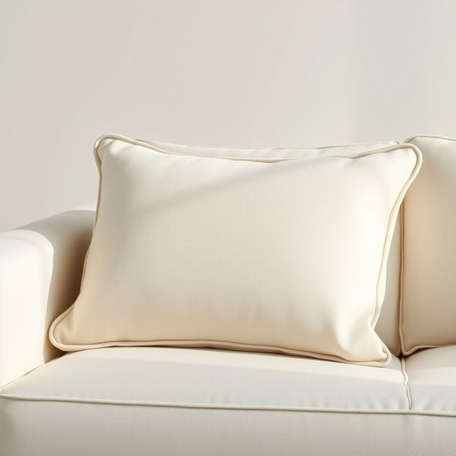

# piping

<h1 style="font-size: 2.5em; font-weight: 300; letter-spacing: 2px; margin: 0; color: #2c3e50;">
/ˈpaɪpɪŋ/
</h1>

---

---

## 例句

When the intricacies of the negotiation became apparent, the diplomat’s meticulous approach did not merely showcase his expertise but also underscored the indispensable role that patience plays in resolving complex international disputes.

*When(/wɪn/) the(/ðə/) intricacies(/ˈɪntrəkəsiz/) of(/əv/) the(/ðə/) negotiation(/nɪˌgoʊʃiˈeɪʃən/) became(/bɪˈkeɪm/) apparent,(/əˈpɛrənt,/) the(/ðə/) diplomat’s(/diplomat’s*/) meticulous(/məˈtɪkjələs/) approach(/əˈproʊʧ/) did(/dɪd/) not(/nɑt/) merely(/ˈmɪrli/) showcase(/ˈʃoʊˌkeɪs/) his(/hɪz/) expertise(/ˌɛkspərˈtiz/) but(/bət/) also(/ˈɔlsoʊ/) underscored(/ˌəndərˈskɔrd/) the(/ðə/) indispensable(/ˌɪndɪˈspɛnsəbəl/) role(/roʊl/) that(/ðət/) patience(/ˈpeɪʃəns/) plays(/pleɪz/) in(/ɪn/) resolving(/riˈzɑlvɪŋ/) complex(/ˈkɑmplɛks/) international(/ˌɪnərˈnæʃənɑl/) disputes.(/dɪˈspjuts./)*

**翻译：** 当谈判的复杂细节显现出来时，这位外交官一丝不苟的做法不仅展示了他的专业素养，更凸显了耐心在解决复杂国际争端中不可或缺的作用。

---

## 解释

英语单词“piping”作为名词在家居生活用品的语境中，主要指缝制或装饰用的包边细管，通常由布料包裹的细长软管，常见于家具、沙发、靠垫、窗帘边缘以及衣物的装饰边缘，起到美观和保护布边的作用。具体使用场合包括描述家居纺织品的细节设计，例如“the sofa with piping around the cushions”（沙发靠垫边缘有包边细管）。英语学习者需要注意“piping”作为不可数名词时多指整体或材料，常见搭配有“decorative piping”（装饰用包边）、“cotton piping”（棉质包边）、“edge piping”（边缘包边）等；同时，“piping hot”（滚烫的）是“piping”另一个含义，但与家居用品无关，不宜混淆。词源上，“piping”源自动词“pipe”的现在分词形式，最初意指细长的管状物，后来引申为用细管状物制作的纺织装饰边缘，这一用法反映了物理外形和功能的关联。中文中，“piping”在家居生活用品领域通常译为“包边”或“滚边”，强调其缝制工艺和装饰作用，因此理解时应侧重于其作为缝纫装饰细节的概念，无褒贬色彩，只是专业术语，用于描述家居用品的设计细节，体现品质和美观的考量。

---

<small style="color: #999; font-size: 0.9em;">2025-07-17 06:22:40</small>

