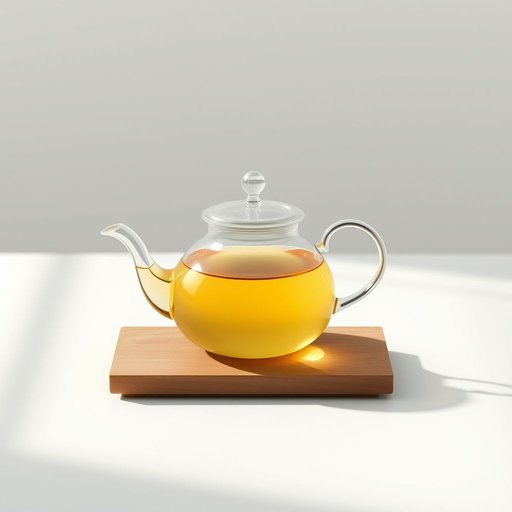

# pitcher

<h1 style="font-size: 2.5em; font-weight: 300; letter-spacing: 2px; margin: 0; color: #2c3e50;">
/ˈpɪʧər/
</h1>

---

---

## 例句

The pitcher carefully balanced the weight of the freshly brewed tea as he approached the dining room, ensuring not a single drop spilled while navigating the crowded space filled with eager guests.

*The(/ðə/) pitcher(/ˈpɪʧər/) carefully(/ˈkɛrfəli/) balanced(/ˈbælənst/) the(/ðə/) weight(/weɪt/) of(/əv/) the(/ðə/) freshly(/ˈfrɛʃli/) brewed(/brud/) tea(/ti/) as(/ɛz/) he(/hi/) approached(/əˈproʊʧt/) the(/ðə/) dining(/ˈdaɪnɪŋ/) room,(/rum,/) ensuring(/ɪnˈʃʊrɪŋ/) not(/nɑt/) a(/ə/) single(/ˈsɪŋgəl/) drop(/drɔp/) spilled(/spɪld/) while(/waɪl/) navigating(/ˈnævəˌgeɪtɪŋ/) the(/ðə/) crowded(/ˈkraʊdɪd/) space(/speɪs/) filled(/fɪld/) with(/wɪθ/) eager(/ˈigər/) guests.(/gɛsts./)*

**翻译：** 那位壶师小心地平衡着新煮茶的重量，走近餐厅时，确保在穿过挤满渴望宾客的空间时一滴未洒。

---

## 解释

英语单词“pitcher”作为家居生活用品领域的名词，通常指用来盛装液体（如水、果汁、牛奶等）的大口容器，多带手柄和壶嘴，便于倾倒，常见于家庭厨房或餐桌中。具体使用场合多为描述餐厅、厨房用具时，或者日常生活中谈及饮料容器。例如，“She filled the pitcher with iced tea”（她把冰茶装进水壶里）。学习者使用时需注意“pitcher”作此义时是可数名词，常见搭配为“a pitcher of water/juice/milk”等，“pitcher”前常用不定冠词或数词修饰，且作主语或宾语时需保证谓语动词数的一致。此外，“pitcher”还有其它含义，如棒球运动中的投手，学习者需根据上下文区分使用。词源方面，“pitcher”源于中古英语“picher”，源自古法语“pichier”，根自拉丁语“pitcherium”，与盛液体容器相关，体现其器皿功能。中文语境中，“pitcher”准确翻译为“水壶”、“壶”或“带壶嘴的罐子”，强调用于盛装和倒液体的实用性，无褒义或贬义色彩，属于中性词汇。文化上，西方家庭中使用“pitcher”较为普遍，体现了生活便利和餐桌礼仪的一部分，而在中文语境中与“茶壶”或“水壶”的概念相似，但“pitcher”一般指更大且多用于冷饮的容器。

---

<small style="color: #999; font-size: 0.9em;">2025-07-17 06:22:40</small>

