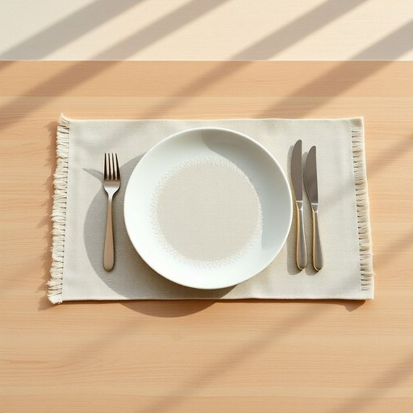

# placemat

<h1 style="font-size: 2.5em; font-weight: 300; letter-spacing: 2px; margin: 0; color: #2c3e50;">
/ˈpleɪsˌmæt/
</h1>

---

---

## 例句

Before we set the table for dinner, could you please make sure that each placemat, which I bought last week because of its vibrant colours and easy-to-clean material, is properly aligned so that the cutlery and glasses sit neatly on top, preventing any spills or stains on the wooden surface?

*Before(/ˌbiˈfɔr/) we(/wi/) set(/sɛt/) the(/ðə/) table(/ˈteɪbəl/) for(/fər/) dinner,(/ˈdɪnər,/) could(/kʊd/) you(/ju/) please(/pliz/) make(/meɪk/) sure(/ʃʊr/) that(/ðət/) each(/iʧ/) placemat,(/ˈpleɪsˌmæt,/) which(/wɪʧ/) I(/aɪ/) bought(/bɔt/) last(/læst/) week(/wik/) because(/bɪˈkəz/) of(/əv/) its(/ɪts/) vibrant(/ˈvaɪbrənt/) colours(/colours*/) and(/ənd/) easy-to-clean(/easy-to-clean*/) material,(/məˈtɪriəl,/) is(/ɪz/) properly(/ˈprɑpərli/) aligned(/əˈlaɪnd/) so(/soʊ/) that(/ðət/) the(/ðə/) cutlery(/ˈkətləri/) and(/ənd/) glasses(/ˈglæsɪz/) sit(/sɪt/) neatly(/ˈnitli/) on(/ɔn/) top,(/tɔp,/) preventing(/prɪˈvɛnɪŋ/) any(/ˈɛni/) spills(/spɪlz/) or(/ər/) stains(/steɪnz/) on(/ɔn/) the(/ðə/) wooden(/ˈwʊdən/) surface?(/ˈsərfəs?/)*

**翻译：** 在我们摆放晚餐餐具之前，能否请你确认一下上周我买的每个餐垫——因其色彩鲜艳且材质易清洁——是否摆放整齐，以确保餐具和杯子能够稳妥地放置其上，避免木质桌面出现任何溢漏或污渍？

---

## 解释

placemat作为名词主要指餐桌上的餐垫，用于放置盘子或餐具，以保护桌面免受食物、液体的污染和刮擦，常见于家庭用餐或餐厅环境。具体使用场合多为就餐时摆放在个人餐位前的装饰性或实用性的垫子，材质多样，有织物、塑料、纸质等。英语学习者在使用该词时应注意其作为可数名词的单复数变化形式（如one placemat, two placemats），常见搭配有“use a placemat”（使用餐垫）、“set the table with placemats”（用餐垫布置餐桌）、“a colorful/cloth/plastic placemat”（彩色/布制/塑料餐垫）等表达，此外该词多用于具体物品的描述，不宜用于抽象概念。在词源方面，placemat由英语单词place（位置、放置）和mat（垫子）合成，起源于对桌面物品放置保护的实际功能描述，体现了合成词通过表意组合构成新词的习惯。中文环境中，placemat准确译为餐垫或餐桌垫，强调其功能性和位置性，通常没有特殊褒贬色彩，是家居生活中的常用实用品，兼具保护作用与一定的装饰性。该词在日常会话和家居布置讨论中较为常见，理解其用途和搭配有助于准确描述餐桌布置相关场景。

---

<small style="color: #999; font-size: 0.9em;">2025-07-17 06:22:40</small>

