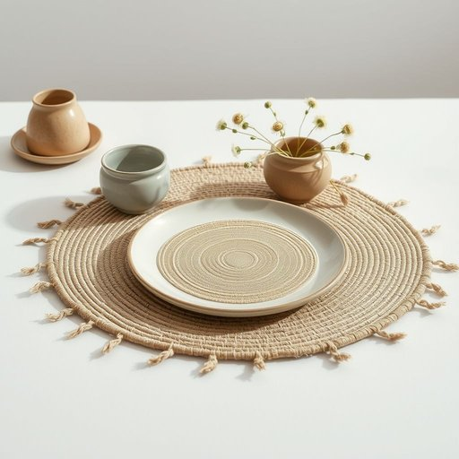

# placemats

<h1 style="font-size: 2.5em; font-weight: 300; letter-spacing: 2px; margin: 0; color: #2c3e50;">
/placemats*/
</h1>

---

---

## 例句

Although the placemats became slightly faded after countless washes, their presence as a placemat still adds a charming, vintage touch to our dining table, perfectly complementing the rustic crockery and the freshly picked wildflowers in the centrepiece.

*Although(/ˌɔlˈðoʊ/) the(/ðə/) placemats(/placemats*/) became(/bɪˈkeɪm/) slightly(/sˈlaɪtli/) faded(/ˈfeɪdɪd/) after(/ˈæftər/) countless(/ˈkaʊntləs/) washes,(/ˈwɑʃɪz,/) their(/ðɛr/) presence(/ˈprɛzəns/) as(/ɛz/) a(/ə/) placemat(/ˈpleɪsˌmæt/) still(/stɪl/) adds(/ædz/) a(/ə/) charming,(/ˈʧɑrmɪŋ,/) vintage(/ˈvɪntɪʤ/) touch(/təʧ/) to(/tɪ/) our(/ɑr/) dining(/ˈdaɪnɪŋ/) table,(/ˈteɪbəl,/) perfectly(/ˈpərfəktli/) complementing(/ˈkɑmpləˌmɛntɪŋ/) the(/ðə/) rustic(/ˈrəstɪk/) crockery(/ˈkrɑkəri/) and(/ənd/) the(/ðə/) freshly(/ˈfrɛʃli/) picked(/pɪkt/) wildflowers(/ˈwaɪldˌflaʊrz/) in(/ɪn/) the(/ðə/) centrepiece.(/centrepiece*./)*

**翻译：** 虽然餐垫经过无数次洗涤后略显褪色，但作为餐垫的它们依然为我们的餐桌增添了一抹迷人的复古韵味，完美衬托出质朴的餐具和摆在中央的新鲜野花。

---

## 解释

单词“placemats”作为名词，指的是餐桌上的餐垫，通常用来保护桌面不被餐具或食物弄脏或划伤，适用于家庭用餐、餐厅环境及任何需要摆放餐具的场合。英语学习者在使用“placemats”时应注意其为复数形式，单数为“placemat”，一般与动词搭配时需保持数的一致，如“set the placemats”（铺设餐垫）或“buy new placemats”（购买新的餐垫）；此外，常见搭配还包括“dining placemats”（用餐餐垫）、“woven placemats”（编织餐垫）等，使用时需注意具体材质或风格形容词的搭配。该词由“place”（地方）和“mat”（垫子）组成，起源于指示放置物体的位置的“place”和表示覆盖物的“mat”，合成后特指放置餐具的垫子，体现其实用功能。中文语境中，“placemats”准确翻译为“餐垫”或“餐桌垫”，理解时应结合其保护桌面和装饰功能，属于家居日用用品范畴，无特殊褒贬色彩，文化内涵主要是体现用餐礼仪与生活品质的细节，通常用来提升餐桌的整洁与美观。

---

<small style="color: #999; font-size: 0.9em;">2025-07-17 06:22:40</small>

