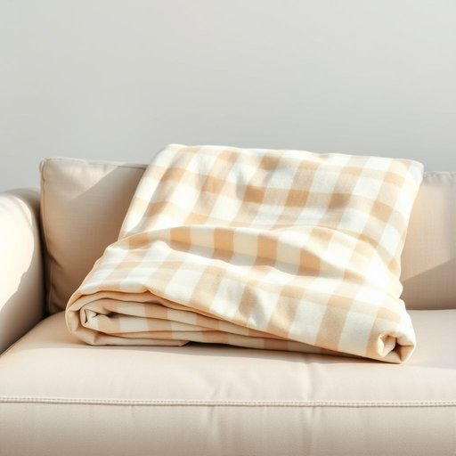

# plaid

<h1 style="font-size: 2.5em; font-weight: 300; letter-spacing: 2px; margin: 0; color: #2c3e50;">
/plæd/
</h1>

---

---

## 例句

The intricate tapestry, woven with threads of gold and crimson, depicted a proud and ancient heritage that reminded the villagers of their ancestors' resilience and unwavering spirit through centuries of hardship.

*The(/ðə/) intricate(/ˈɪntrəkət/) tapestry,(/ˈtæpəstri,/) woven(/ˈwoʊvən/) with(/wɪθ/) threads(/θrɛdz/) of(/əv/) gold(/goʊld/) and(/ənd/) crimson,(/ˈkrɪmzən,/) depicted(/dɪˈpɪktɪd/) a(/ə/) proud(/praʊd/) and(/ənd/) ancient(/ˈeɪnʧənt/) heritage(/ˈhɛrɪtɪʤ/) that(/ðət/) reminded(/riˈmaɪndɪd/) the(/ðə/) villagers(/ˈvɪlɪʤərz/) of(/əv/) their(/ðɛr/) ancestors'(/ˈænˌsɛstərz'/) resilience(/rɪˈzɪljəns/) and(/ənd/) unwavering(/ənˈweɪvərɪŋ/) spirit(/ˈspɪrɪt/) through(/θru/) centuries(/ˈsɛnʧəriz/) of(/əv/) hardship.(/ˈhɑrdʃɪp./)*

**翻译：** 这幅由金色与深红色丝线交织而成的精美挂毯，展现了一个自豪而古老的传承，提醒着村民们他们的祖先在数百年艰难困苦中所展现出的坚韧与不屈精神。

---

## 解释

英语单词“plaid”作为名词在家居生活用品的语境中，通常指具有格子花纹的织物，特别是用于制作毛毯、披肩、抱枕套等装饰或保暖用品时的图案。具体使用场合多见于描述家居装饰风格、纺织品材质或在购买、选购服饰和家居用品时提及这类图案的织物。例如，人们会说“一条舒适的格子毛毯”或“沙发上的格子靠垫”。英语学习者需要注意的是，“plaid”作为可数名词时可指一种带格子花纹的布料或成品织物，复数形式为“plaids”，但在描述图案时也可作为不可数名词使用。同时，常见搭配包括“plaid pattern”“plaid fabric”“plaid blanket”“plaid scarf”等，表达上多用来突出产品的图案风格，形容词性用法则常见于“plaid shirt”（格子衬衫）等。词源方面，“plaid”源自苏格兰盖尔语“plaide”，意指“毯子”或“大块布”，反映其起初为苏格兰地区特色的格子织物，具有浓厚的民族与传统文化背景，因此在英语中也具备一定的文化内涵，往往与苏格兰传统服饰（如苏格兰裙）和家居的温暖、复古氛围相关联。在中文语境中，“plaid”准确翻译通常为“格子花纹（布）”或简称“格子”，但需区别于普通的“格子”，因为“plaid”常特指苏格兰风格的那种特定多色格子图案。总体而言，该词语在家居用品类场景下属于中性词汇，既无褒义也无贬义，主要传达一种视觉和风格元素，有时带有怀旧、温馨或乡村风的文化色彩。

---

<small style="color: #999; font-size: 0.9em;">2025-07-17 06:22:40</small>

