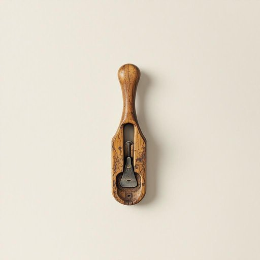

# plane

<h1 style="font-size: 2.5em; font-weight: 300; letter-spacing: 2px; margin: 0; color: #2c3e50;">
/pleɪn/
</h1>

---

---

## 例句

While tidying up the workshop, I found the old wooden plane, which, despite its worn handle and dulled blade, still holds the potential to smooth out the rough edges of that oak shelf we’ve been meaning to fix for months.

*While(/waɪl/) tidying(/tidying*/) up(/əp/) the(/ðə/) workshop,(/ˈwərkˌʃɑp,/) I(/aɪ/) found(/faʊnd/) the(/ðə/) old(/oʊld/) wooden(/ˈwʊdən/) plane,(/pleɪn,/) which,(/wɪʧ,/) despite(/dɪˈspaɪt/) its(/ɪts/) worn(/wɔrn/) handle(/ˈhændəl/) and(/ənd/) dulled(/dəld/) blade,(/bleɪd,/) still(/stɪl/) holds(/hoʊldz/) the(/ðə/) potential(/pəˈtɛnʃəl/) to(/tɪ/) smooth(/smuð/) out(/aʊt/) the(/ðə/) rough(/rəf/) edges(/ˈɛʤɪz/) of(/əv/) that(/ðət/) oak(/oʊk/) shelf(/ʃɛlf/) we’ve(/we’ve*/) been(/bɪn/) meaning(/ˈminɪŋ/) to(/tɪ/) fix(/fɪks/) for(/fər/) months.(/mənθs./)*

**翻译：** 整理车间时，我发现了那把旧木刨，虽然手柄已磨损、刃口钝化，但它依然有能力把我们搁置了数月的橡木架子上的粗糙边缘刨平。

---

## 解释

英语单词plane在家居生活用品的语境中，作为名词通常指的是刨子，即一种用于木工表面对木材进行削平或修整的手工工具。具体使用场合多见于木工爱好者、家具制作或维修等场景，当需要将木材表面刨平、调整厚度或去除不平整部分时使用。英语学习者在使用plane表达该含义时，应注意其作为名词时拼写固定，且不要与airplane（飞机）混淆；常见搭配有hand plane（手刨）、wood plane（木工刨），以及use a plane to smooth the surface（用刨子打磨表面）。语法上plane作为可数名词，需根据数量使用单复数形式，如a plane或two planes。词源方面，plane源于拉丁语planum，意为平面，反映其工具功能为使木材表面变平坦，传入英语后形成了指称刨子的用法。在中文语境中应准确翻译为刨子或木工刨，避免与飞机混淆。该词在家居用品领域无褒贬色彩，属于中性词汇，强调其实用功能及工艺属性，文化内涵较弱，主要体现对木工技艺的专业性描述。

---

<small style="color: #999; font-size: 0.9em;">2025-07-17 06:22:40</small>

