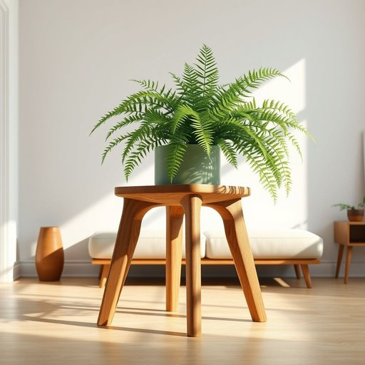

# plant-stand

<h1 style="font-size: 2.5em; font-weight: 300; letter-spacing: 2px; margin: 0; color: #2c3e50;">
/plant-stand*/
</h1>

---

---

## 例句

After carefully rearranging the living room to maximize natural light, she decided that the intricate wooden plant-stand, which her grandmother had handcrafted decades ago and featured elegant carvings along its legs, would be the perfect spot not only to showcase her thriving fern but also to add a touch of vintage charm to the otherwise modern décor.

*After(/ˈæftər/) carefully(/ˈkɛrfəli/) rearranging(/ˌriərˈeɪnʤɪŋ/) the(/ðə/) living(/ˈlɪvɪŋ/) room(/rum/) to(/tɪ/) maximize(/ˈmæksəˌmaɪz/) natural(/ˈnæʧərəl/) light,(/laɪt,/) she(/ʃi/) decided(/ˌdɪˈsaɪdɪd/) that(/ðət/) the(/ðə/) intricate(/ˈɪntrəkət/) wooden(/ˈwʊdən/) plant-stand,(/plant-stand*,/) which(/wɪʧ/) her(/hər/) grandmother(/ˈgrændˌməðər/) had(/hæd/) handcrafted(/ˈhændˌkræftɪd/) decades(/ˈdɛkeɪdz/) ago(/əˈgoʊ/) and(/ənd/) featured(/ˈfiʧərd/) elegant(/ˈɛləgənt/) carvings(/ˈkɑrvɪŋz/) along(/əˈlɔŋ/) its(/ɪts/) legs,(/lɛgz,/) would(/wʊd/) be(/bi/) the(/ðə/) perfect(/ˈpərˌfɪkt/) spot(/spɑt/) not(/nɑt/) only(/ˈoʊnli/) to(/tɪ/) showcase(/ˈʃoʊˌkeɪs/) her(/hər/) thriving(/θˈraɪvɪŋ/) fern(/fərn/) but(/bət/) also(/ˈɔlsoʊ/) to(/tɪ/) add(/æd/) a(/ə/) touch(/təʧ/) of(/əv/) vintage(/ˈvɪntɪʤ/) charm(/ʧɑrm/) to(/tɪ/) the(/ðə/) otherwise(/ˈəðərˌwaɪz/) modern(/ˈmɑdərn/) décor.(/décor*./)*

**翻译：** 在经过细心调整客厅布置以最大化自然光照后，她决定那座由祖母几十年前亲手制作、腿部雕刻精美的复杂木质花架不仅是展示她茂盛蕨类植物的绝佳位置，也能为原本现代的装饰增添一抹复古韵味。

---

## 解释

“plant-stand”作为名词在家居生活用品的语境中，指的是用于摆放植物盆栽的架子或支架，常见于客厅、阳台或花园内，用以美化环境和方便植物的照顾。具体使用场合通常包括室内装饰、园艺摆设或花卉展示，例如“a wooden plant-stand”（一个木制花架）、“a metal plant-stand for the living room”（客厅用的金属花架）。英语学习者需要注意的是“plant-stand”作为复合名词，通常连写或用连字符连接，前半部分“plant”作定语，后半部分“stand”作中心词，语法上相当稳定，常见搭配如“wooden plant-stand”（木制花架）、“tiered plant-stand”（多层花架）等。同时，该词多用于具体可数名词形式，表达时注意定冠词和形容词的位置。词源方面，“plant-stand”由“plant”（植物）和“stand”（支架、架子）结合而成，直观描述其功能，起源于室内外园艺兴起后对植物摆放器具的需求。中文语境中，最佳翻译为“花架”或“花盆架”，强调其专门用于摆放花盆或植物的功能，避免误解为“工厂”或“工厂区”等“plant”的另一义。该词本身无特殊褒贬色彩，是一种中性、功能性强的生活用语，体现了现代居家对绿色植物陈设的重视，属于中性且实用的家居用品词汇。

---

<small style="color: #999; font-size: 0.9em;">2025-07-17 06:22:40</small>

