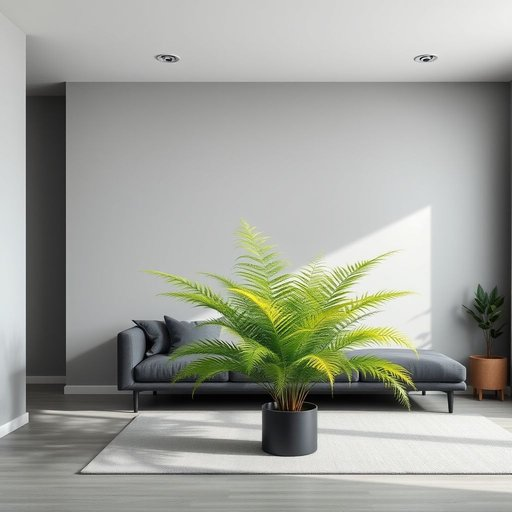

# plant

<h1 style="font-size: 2.5em; font-weight: 300; letter-spacing: 2px; margin: 0; color: #2c3e50;">
/plænt/
</h1>

---

---

## 例句

The large fern in the corner, which Mike carefully chose because it thrives in low light and requires minimal watering, has really transformed the atmosphere of the living room, making it feel more vibrant and homely despite the otherwise minimalistic decor dominated by greys and blacks.

*The(/ðə/) large(/lɑrʤ/) fern(/fərn/) in(/ɪn/) the(/ðə/) corner,(/ˈkɔrnər,/) which(/wɪʧ/) Mike(/maɪk/) carefully(/ˈkɛrfəli/) chose(/ʧoʊz/) because(/bɪˈkəz/) it(/ɪt/) thrives(/θraɪvz/) in(/ɪn/) low(/loʊ/) light(/laɪt/) and(/ənd/) requires(/rikˈwaɪərz/) minimal(/ˈmɪnəməl/) watering,(/ˈwɔtərɪŋ,/) has(/həz/) really(/ˈrɪli/) transformed(/trænsˈfɔrmd/) the(/ðə/) atmosphere(/ˈætməsˌfɪr/) of(/əv/) the(/ðə/) living(/ˈlɪvɪŋ/) room,(/rum,/) making(/ˈmeɪkɪŋ/) it(/ɪt/) feel(/fil/) more(/mɔr/) vibrant(/ˈvaɪbrənt/) and(/ənd/) homely(/ˈhoʊmli/) despite(/dɪˈspaɪt/) the(/ðə/) otherwise(/ˈəðərˌwaɪz/) minimalistic(/minimalistic*/) decor(/ˈdeɪkɔr/) dominated(/ˈdɑməˌneɪtəd/) by(/baɪ/) greys(/greys*/) and(/ənd/) blacks.(/blæks./)*

**翻译：** 角落里那盆大型蕨类植物是迈克精心挑选的，因为它适合在弱光环境中生长且需水量少，确实改变了客厅的氛围，使整个空间在灰黑色调为主的极简装饰中显得更加生机勃勃且温馨宜人。

---

## 解释

在家居生活用品的语境中，英语单词"plant"作为名词通常指的是“植物”，即家庭中种植用来装饰、美化环境或净化空气的绿植或花卉。具体使用场合包括谈论室内装饰、园艺兴趣或者描述某个空间内摆放的绿色生物时，例如“house plants”（室内植物）、“potted plants”（盆栽植物）等。英语学习者在使用该词时应注意，作为名词时"plant"通常是可数名词，复数形式为"plants"，且在具体指代不同种类的植物时可用复数；另外在表达时常与形容词连用作定语，如“tropical plants”（热带植物）、“indoor plants”（室内植物），学习者还应留意区分其与动词形式的用法，避免混淆。词语"plant"源自拉丁语“planta”，意为“幼苗”或“种植物”，这一原初含义延续至今，反映了其与种植、成长的密切联系。在中文语境中，“plant”对应的准确翻译为“植物”，不过在家居场景下多指室内绿植或盆栽，与一般意义上的树木或农作物区别开来，没有明显褒贬色彩，常带有环保、美化生活环境的积极文化内涵，体现了人们对自然美的追求和生活质量的注重。

---

<small style="color: #999; font-size: 0.9em;">2025-07-17 06:22:40</small>

