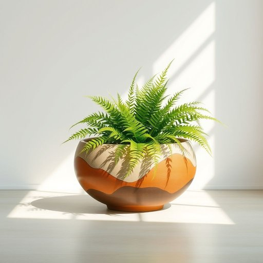

# planter

<h1 style="font-size: 2.5em; font-weight: 300; letter-spacing: 2px; margin: 0; color: #2c3e50;">
/ˈplæntər/
</h1>

---

---

## 例句

I've just bought a large ceramic planter, which, due to its intricate hand-painted design and sturdy build, not only serves as the perfect home for my fern by the window but also adds a touch of elegance to the living room's overall decor.

*I've(/aɪv/) just(/ʤɪst/) bought(/bɔt/) a(/ə/) large(/lɑrʤ/) ceramic(/sərˈæmɪk/) planter,(/ˈplæntər,/) which,(/wɪʧ,/) due(/du/) to(/tɪ/) its(/ɪts/) intricate(/ˈɪntrəkət/) hand-painted(/hand-painted*/) design(/dɪˈzaɪn/) and(/ənd/) sturdy(/ˈstərdi/) build,(/bɪld,/) not(/nɑt/) only(/ˈoʊnli/) serves(/sərvz/) as(/ɛz/) the(/ðə/) perfect(/ˈpərˌfɪkt/) home(/hoʊm/) for(/fər/) my(/maɪ/) fern(/fərn/) by(/baɪ/) the(/ðə/) window(/ˈwɪndoʊ/) but(/bət/) also(/ˈɔlsoʊ/) adds(/ædz/) a(/ə/) touch(/təʧ/) of(/əv/) elegance(/ˈɛləgəns/) to(/tɪ/) the(/ðə/) living(/ˈlɪvɪŋ/) room's(/rumz/) overall(/ˈoʊvərˌɔl/) decor.(/ˈdeɪkɔr./)*

**翻译：** 我刚买了一个大型陶瓷花盆，凭借其精美的手绘图案和坚固的结构，不仅成为了窗边蕨类植物的理想之选，还为客厅整体装饰增添了一抹雅致。

---

## 解释

英语单词“planter”作为家居生活用品中的名词，通常指用来种植花草或植物的容器，如花盆或种植箱，适用于室内外摆放，能够承载土壤和植物以便观赏或绿化环境。在具体使用场合中，planter多见于园艺、家居装饰或室内设计领域，例如描述阳台上的装饰花盆或客厅中的大型植物箱。英语学习者在使用该词时应注意其作为可数名词的语法规则，通常与形容词连用（如“large planter”，“decorative planter”），或与介词短语搭配说明用途或位置（如“a planter for succulents”或“a planter by the window”），此外，planter常与具体植物名称、材质（如陶瓷、木质、塑料等）搭配使用以丰富表达。词源方面，planter源自拉丁语“plantare”，意为种植，最初用来指种植者，即植树或种植的人，后来引申指用于种植的器具。中文语境中，“planter”准确翻译为“花盆”、“种植箱”或“种植容器”，强调其盛载植物及土壤的功能，而非种植者本身。在文化色彩上，该词较为中性，无明显褒贬含义，但在家居装饰语境下，选择合适材质、款式的planter往往关系到美观与实用，体现了居家生活的品质和审美追求。

---

<small style="color: #999; font-size: 0.9em;">2025-07-17 06:22:40</small>

