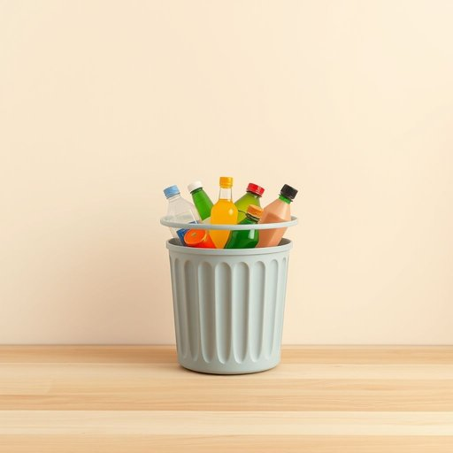

# plastic

<h1 style="font-size: 2.5em; font-weight: 300; letter-spacing: 2px; margin: 0; color: #2c3e50;">
/ˈplæstɪk/
</h1>

---

---

## 例句

Could you please take out the plastic from the recycling bin, the kinds that come in colourful bottles and food containers, because the council only collects specific types on Wednesdays, and if we mix them up, they won’t be processed properly?

*Could(/kʊd/) you(/ju/) please(/pliz/) take(/teɪk/) out(/aʊt/) the(/ðə/) plastic(/ˈplæstɪk/) from(/frəm/) the(/ðə/) recycling(/riˈsaɪkəlɪŋ/) bin,(/bɪn,/) the(/ðə/) kinds(/kaɪnz/) that(/ðət/) come(/kəm/) in(/ɪn/) colourful(/colourful*/) bottles(/ˈbɑtəlz/) and(/ənd/) food(/fud/) containers,(/kənˈteɪnərz,/) because(/bɪˈkəz/) the(/ðə/) council(/ˈkaʊnsəl/) only(/ˈoʊnli/) collects(/kəˈlɛkts/) specific(/spɪˈsɪfɪk/) types(/taɪps/) on(/ɔn/) Wednesdays,(/ˈwɛnzˌdeɪz,/) and(/ənd/) if(/ɪf/) we(/wi/) mix(/mɪks/) them(/ðɛm/) up,(/əp,/) they(/ðeɪ/) won’t(/won’t*/) be(/bi/) processed(/ˈprɑsɛst/) properly?(/ˈprɑpərli?/)*

**翻译：** 您能否请将回收箱中的塑料物品挑出来，尤其是装在彩色瓶子和食品容器里的那种，因为市政部门只在星期三收集特定种类，若混在一起便无法妥善处理。

---

## 解释

英语单词'plastic'作为名词在家居生活用品场景中通常指代“塑料”这种材料，具体使用场合多见于描述日常用品的材质，如塑料瓶、塑料盒、塑料家具等，语境往往是谈论物品的材质、环保问题或制造工艺。学习者使用时需注意，作为不可数名词时，plastic一般不加复数形式，不用冠词表示整体材质，比如"The chair is made of plastic."但在指代某种具体塑料制品时，有时也可用作可数名词，如"a plastic"意指一个塑料制品，但较少见。此外，plastic常与介词“of”搭配表示材料来源，如“made of plastic”，也常与形容词连用构成复合名词，例如“plastic bottle”“plastic container”等，方便表达具体物品。词源方面，plastic来源希腊语“plastikos”，意为“可塑的”，最早指可以塑造的材料，19世纪末因人工合成材料的出现而延伸为现代含义。中文语境下，plastic准确翻译为“塑料”，表示一种合成高分子材料，既能形容材料性质，也泛指由此制成的制品。在文化含义上，plastic在环保语境下常带有负面色彩，暗示难降解、污染环境等问题，因此有时使用时需要注意语境避免误解。在日常交流中，将plastic用作名词表达家居用品材料时，能清楚传达物品的实用属性和环保考虑，是生活中常见且基础的表达。

---

<small style="color: #999; font-size: 0.9em;">2025-07-17 06:22:40</small>

