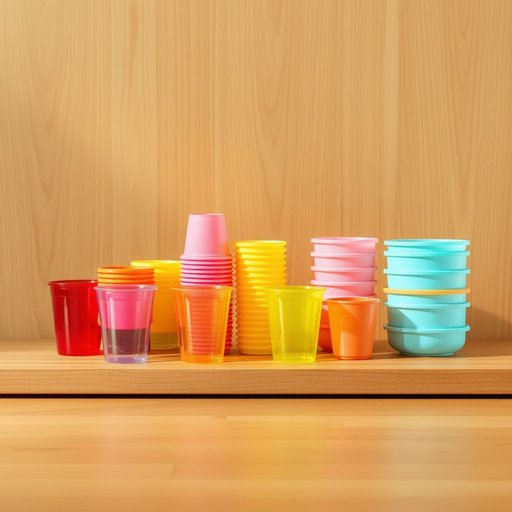

# plasticware

<h1 style="font-size: 2.5em; font-weight: 300; letter-spacing: 2px; margin: 0; color: #2c3e50;">
/plasticware*/
</h1>

---

---

## 例句

Could you please unpack the dishwasher while I sort through the cupboard to find the plasticware, such as the colourful tumblers and stackable food containers, that we usually use for picnics and quick takeaways, since I want to make sure everything is clean and organised before our guests arrive?

*Could(/kʊd/) you(/ju/) please(/pliz/) unpack(/ənˈpæk/) the(/ðə/) dishwasher(/ˈdɪʃˌwɑʃər/) while(/waɪl/) I(/aɪ/) sort(/sɔrt/) through(/θru/) the(/ðə/) cupboard(/ˈkəbərd/) to(/tɪ/) find(/faɪnd/) the(/ðə/) plasticware,(/plasticware*,/) such(/səʧ/) as(/ɛz/) the(/ðə/) colourful(/colourful*/) tumblers(/ˈtəmblərz/) and(/ənd/) stackable(/stackable*/) food(/fud/) containers,(/kənˈteɪnərz,/) that(/ðət/) we(/wi/) usually(/ˈjuʒəwəli/) use(/juz/) for(/fər/) picnics(/ˈpɪkˌnɪks/) and(/ənd/) quick(/kwɪk/) takeaways,(/takeaways*,/) since(/sɪns/) I(/aɪ/) want(/wɔnt/) to(/tɪ/) make(/meɪk/) sure(/ʃʊr/) everything(/ˈɛvriˌθɪŋ/) is(/ɪz/) clean(/klin/) and(/ənd/) organised(/organised*/) before(/ˌbiˈfɔr/) our(/ɑr/) guests(/gɛsts/) arrive?(/əraɪv?/)*

**翻译：** 你能在我整理橱柜找我们通常用于野餐和便捷外卖的塑料器皿（比如色彩缤纷的水杯和可叠放的食品盒）时，帮忙把洗碗机里的碗筷取出来吗？我想确保在客人到来之前，一切都干净整洁。

---

## 解释

plasticware作为名词，指的是由塑料制成的家居生活用品，通常包括塑料餐具如盘子、杯子、刀叉勺、储物容器、厨房用具等，主要用于饮食和储存方面的场合，如家庭餐桌、野餐、学校食堂或户外活动中。英语学习者在使用该词时应注意其不可数名词的属性，通常不加复数形式，且常与限定词连用，如some plasticware（一种塑料制品）或者a set of plasticware（一套餐具套装），此外，可搭配描述材质、用途的形容词如disposable plasticware（一次性塑料制品）进行表达。该词由plastic（塑料）和ware（制品、用品）合成，英语中ware源自古英语，意为货物、物品，用以表示某类制成品。中文里，plasticware准确翻译为塑料制品或塑料餐具，具体应根据语境调整，如专指餐具时译为塑料餐具，泛指则为塑料制品。该词表达中性，无明显褒贬含义，但考虑到环保趋势，塑料制品在现代语境中可能隐含对一次性使用和环境负担的负面评价，学习者使用时应结合环境保护的语态和文化背景理解。

---

<small style="color: #999; font-size: 0.9em;">2025-07-17 06:22:40</small>

