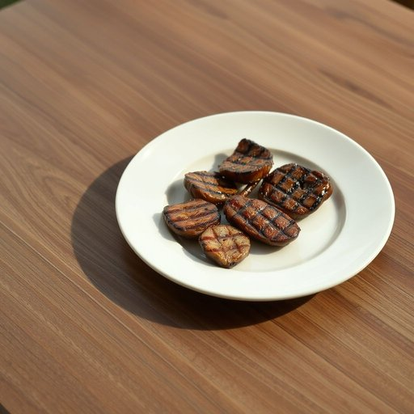

# plate

<h1 style="font-size: 2.5em; font-weight: 300; letter-spacing: 2px; margin: 0; color: #2c3e50;">
/pleɪt/
</h1>

---

---

## 例句

Could you please put the plate that has the leftover roast on it in the fridge before you start washing up, since we don’t want the food to spoil and the kitchen to get messy?

*Could(/kʊd/) you(/ju/) please(/pliz/) put(/pʊt/) the(/ðə/) plate(/pleɪt/) that(/ðət/) has(/həz/) the(/ðə/) leftover(/ˈlɛfˌtoʊvər/) roast(/roʊst/) on(/ɔn/) it(/ɪt/) in(/ɪn/) the(/ðə/) fridge(/frɪʤ/) before(/ˌbiˈfɔr/) you(/ju/) start(/stɑrt/) washing(/ˈwɑʃɪŋ/) up,(/əp,/) since(/sɪns/) we(/wi/) don’t(/don’t*/) want(/wɔnt/) the(/ðə/) food(/fud/) to(/tɪ/) spoil(/spɔɪl/) and(/ənd/) the(/ðə/) kitchen(/ˈkɪʧən/) to(/tɪ/) get(/gɪt/) messy?(/ˈmɛsi?/)*

**翻译：** 请您在开始洗碗之前，把盛有剩余烤肉的盘子放进冰箱，好避免食物变质和厨房凌乱。

---

## 解释

英语单词“plate”作为名词在家居生活用品的语境中主要指用来盛放食物的盘子，通常是圆形、扁平而有一定深度的餐具，适用于吃饭、摆放菜肴等场合。英语学习者使用该词时需注意其单复数形式“plate/plates”，不可数的语义一般不适用，同时常与动词搭配如“set the table with plates”（摆放盘子）、“a stack of plates”（一摞盘子）或形容词搭配如“ceramic plate”（陶瓷盘）、“dinner plate”（主菜盘）等。此外，“plate”也可用作动词，但在家居语境中作为名词时主要指餐具。词源方面，“plate”起源于中古英语“plate”，借自古法语“plate”，意指扁平的金属片，最初的含义带有金属的扁平片状物，后来引申为扁平的盘子，与餐具的形态相符。在中文中，“plate”对应的准确翻译是“盘子”或“餐盘”，意指用于盛装食物的器皿，强调其形状扁平、用途日常，无褒贬色彩，但在文化语境中，盘子的材质和款式有时反映出家庭的生活品质或文化习惯，使用时要结合具体语境理解。整体来看，“plate”作为家居生活用品的名词是一个基础且常见的词汇，应用广泛且表达清晰明了。

---

<small style="color: #999; font-size: 0.9em;">2025-07-17 06:22:40</small>

