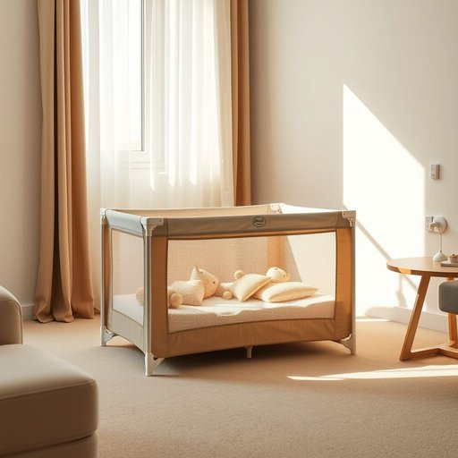

# playpen

<h1 style="font-size: 2.5em; font-weight: 300; letter-spacing: 2px; margin: 0; color: #2c3e50;">
/ˈpleɪˌpɛn/
</h1>

---

---

## 例句

While I was tidying up the living room, I realised that the collapsible playpen, which we usually set up near the window to give the baby a safe space to play with their toys and keep them away from the sharp corners of the coffee table and electrical sockets, had a small tear in the mesh that would need repairing before we could use it again.

*While(/waɪl/) I(/aɪ/) was(/wɑz/) tidying(/tidying*/) up(/əp/) the(/ðə/) living(/ˈlɪvɪŋ/) room,(/rum,/) I(/aɪ/) realised(/ˈriəˌlaɪzd/) that(/ðət/) the(/ðə/) collapsible(/kəˈlæpsəbəl/) playpen,(/ˈpleɪˌpɛn,/) which(/wɪʧ/) we(/wi/) usually(/ˈjuʒəwəli/) set(/sɛt/) up(/əp/) near(/nɪr/) the(/ðə/) window(/ˈwɪndoʊ/) to(/tɪ/) give(/gɪv/) the(/ðə/) baby(/ˈbeɪbi/) a(/ə/) safe(/seɪf/) space(/speɪs/) to(/tɪ/) play(/pleɪ/) with(/wɪθ/) their(/ðɛr/) toys(/tɔɪz/) and(/ənd/) keep(/kip/) them(/ðɛm/) away(/əˈweɪ/) from(/frəm/) the(/ðə/) sharp(/ʃɑrp/) corners(/ˈkɔrnərz/) of(/əv/) the(/ðə/) coffee(/ˈkɔfi/) table(/ˈteɪbəl/) and(/ənd/) electrical(/ɪˈlɛktrɪkəl/) sockets,(/ˈsɑkəts,/) had(/hæd/) a(/ə/) small(/smɔl/) tear(/tɪr/) in(/ɪn/) the(/ðə/) mesh(/mɛʃ/) that(/ðət/) would(/wʊd/) need(/nid/) repairing(/rɪˈpɛrɪŋ/) before(/ˌbiˈfɔr/) we(/wi/) could(/kʊd/) use(/juz/) it(/ɪt/) again.(/əˈgɛn./)*

**翻译：** 当我整理客厅时，发现我们平时放在窗边，为宝宝提供一个安全的玩耍空间，避免他们接触茶几尖角和电源插座的折叠式游戏围栏的网眼处有一处小裂口，需要修补后才能再次使用。

---

## 解释

playpen作为名词在家居生活用品场景中指的是一种儿童游戏围栏，通常为围成一定空间的便携式安全围栏，供婴幼儿在家中玩耍时限制活动范围，防止跌倒或接触危险物品，常见于有小孩的家庭环境。使用该词时，英语学习者应注意其为可数名词，通常与冠词连用，如a playpen，或用复数形式playpens，且常与动词set up、put the baby in搭配使用，表达安置儿童于安全区域的意思。该词源于play（玩耍）和pen（围栏或围场）的组合，最初指为动物设立的圈栏延伸为儿童专用的安全游戏区域。中文通常翻译为游戏围栏或儿童游戏围栏，强调其安全和限制活动范围的功能。该词本身无明显褒贬色彩，属于中性词汇，但在实际使用中隐含对儿童安全保护的正面意义，体现对婴幼儿看护的关注和责任感。

---

<small style="color: #999; font-size: 0.9em;">2025-07-17 06:22:40</small>

