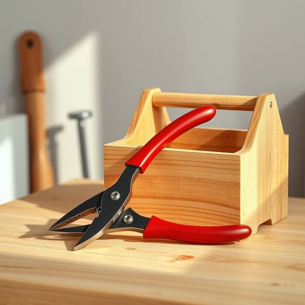

# plier

<h1 style="font-size: 2.5em; font-weight: 300; letter-spacing: 2px; margin: 0; color: #2c3e50;">
/plaɪər/
</h1>

---

---

## 例句

Could you please hand me the plier that’s lying next to the toolbox on the workbench, the one with the red handles that we bought last summer, so I can tighten the loose screws on the kitchen cabinet before preparing dinner?

*Could(/kʊd/) you(/ju/) please(/pliz/) hand(/hænd/) me(/mi/) the(/ðə/) plier(/plaɪər/) that’s(/that’s*/) lying(/laɪɪŋ/) next(/nɛkst/) to(/tɪ/) the(/ðə/) toolbox(/ˈtulˌbɔks/) on(/ɔn/) the(/ðə/) workbench,(/ˈwərkˌbɛnʧ,/) the(/ðə/) one(/wən/) with(/wɪθ/) the(/ðə/) red(/rɛd/) handles(/ˈhændəlz/) that(/ðət/) we(/wi/) bought(/bɔt/) last(/læst/) summer,(/ˈsəmər,/) so(/soʊ/) I(/aɪ/) can(/kən/) tighten(/ˈtaɪtən/) the(/ðə/) loose(/lus/) screws(/skruz/) on(/ɔn/) the(/ðə/) kitchen(/ˈkɪʧən/) cabinet(/ˈkæbənət/) before(/ˌbiˈfɔr/) preparing(/pərˈpɛrɪŋ/) dinner?(/ˈdɪnər?/)*

**翻译：** 请把工作台上工具箱旁边那个带红色手柄的钳子递给我，就是我们去年夏天买的那个，我要用它拧紧厨房橱柜上松动的螺丝，然后准备晚饭。

---

## 解释

plier作为名词在家居生活用品的语境中指的是钳子，是一种手工工具，通常用于夹紧、弯曲、剪切或扭转物体，常见于家用维修、电工、手工艺等场合。英语学习者需要注意的是，plier多以复数形式pliers出现，表示一把钳子，单数plier较少使用且有时表达不明确，因此pliers是更规范和常见的用法。plier本身是可数名词，但复数形式并非指多把钳子，而是一把钳子的单位，这一用法与一般名词复数有所不同，需要区分。常见搭配如needle-nose pliers（尖嘴钳）、cutting pliers（剪线钳）等。词源方面，plier源自拉丁语plicare，意为折叠或弯曲，反映了工具的功能特点，即通过施力弯曲或夹持物体。在中文语境中，plier准确翻译为钳子，涵盖了多种形态和用途的钳类工具，属于中性词汇，无特殊褒贬含义或文化内涵。使用时应避免将其误用为单数复数不一致的情况，掌握其工具属性及复数形式的特殊用法，有助于在日常交流和技术语境中准确表达。

---

<small style="color: #999; font-size: 0.9em;">2025-07-17 06:22:40</small>

