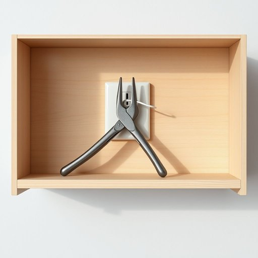

# pliers

<h1 style="font-size: 2.5em; font-weight: 300; letter-spacing: 2px; margin: 0; color: #2c3e50;">
/plaɪərz/
</h1>

---

---

## 例句

Could you please pass me the pliers from the toolbox on the shelf, since I need to carefully twist the loose wire behind the socket without damaging the surrounding cables or the wall paint?

*Could(/kʊd/) you(/ju/) please(/pliz/) pass(/pæs/) me(/mi/) the(/ðə/) pliers(/plaɪərz/) from(/frəm/) the(/ðə/) toolbox(/ˈtulˌbɔks/) on(/ɔn/) the(/ðə/) shelf,(/ʃɛlf,/) since(/sɪns/) I(/aɪ/) need(/nid/) to(/tɪ/) carefully(/ˈkɛrfəli/) twist(/twɪst/) the(/ðə/) loose(/lus/) wire(/waɪər/) behind(/bɪˈhaɪnd/) the(/ðə/) socket(/ˈsɑkət/) without(/wɪˈθaʊt/) damaging(/ˈdæmɪʤɪŋ/) the(/ðə/) surrounding(/sərˈaʊndɪŋ/) cables(/ˈkeɪbəlz/) or(/ər/) the(/ðə/) wall(/wɔl/) paint?(/peɪnt?/)*

**翻译：** 您能帮我从架子上的工具箱里递给我那把钳子吗？我需要小心地扭紧插座后面松动的电线，避免损坏周围的电缆或墙面的油漆。

---

## 解释

英语单词“pliers”作为名词，在家居生活用品的语境中指的是一种常见的手动工具，用于夹持、扭转、剪断或弯曲物体，通常由两只金属臂通过铰链连接而成，带有带齿的夹口以增强抓握力。具体使用场合多见于家庭修理、电工作业或手工制作过程中，如紧固电线、拉拔钉子或弯曲金属丝等。在语法上，“pliers”通常以复数形式出现，因为它指的是一对工具，单数形式较少使用，且不可数；学习者应注意“a pair of pliers”是更常见的表达方式来强调数量。常见搭配有“use pliers”（使用钳子）、“needle-nose pliers”（尖嘴钳）、“cutting pliers”（剪切钳）等，这些短语有助于明确具体类型和功能。词源方面，“pliers”源自中古英语“plyer”，意指能“折叠”或“折弯”的工具，而拉丁语词根“plicare”含义为“折叠”，反映了该工具操作的基本原理。在中文语境中，“pliers”准确翻译为“钳子”，涵盖了钳、镊、剪等多种细分工具的统称，强调其实用性和多功能性。该词无特殊语言色彩或褒贬含义，属中性词汇，广泛应用于日常生活和专业领域，理解其功能特征和应用场景对于语言学习者准确把握和使用至关重要。

---

<small style="color: #999; font-size: 0.9em;">2025-07-17 06:22:40</small>

