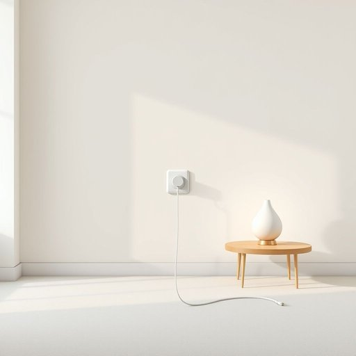

# plug

<h1 style="font-size: 2.5em; font-weight: 300; letter-spacing: 2px; margin: 0; color: #2c3e50;">
/pləg/
</h1>

---

---

## 例句

Before the plug’s secure connection was verified, the intricate assembly of the lamp in the living room was delayed due to concerns about potential electrical hazards caused by the obscured and tangled cables surrounding the plug.

*Before(/ˌbiˈfɔr/) the(/ðə/) plug’s(/plug’s*/) secure(/sɪˈkjʊr/) connection(/kəˈnɛkʃən/) was(/wɑz/) verified,(/ˈvɛrəˌfaɪd,/) the(/ðə/) intricate(/ˈɪntrəkət/) assembly(/əˈsɛmbli/) of(/əv/) the(/ðə/) lamp(/læmp/) in(/ɪn/) the(/ðə/) living(/ˈlɪvɪŋ/) room(/rum/) was(/wɑz/) delayed(/dɪˈleɪd/) due(/du/) to(/tɪ/) concerns(/kənˈsərnz/) about(/əˈbaʊt/) potential(/pəˈtɛnʃəl/) electrical(/ɪˈlɛktrɪkəl/) hazards(/ˈhæzərdz/) caused(/kɔzd/) by(/baɪ/) the(/ðə/) obscured(/əbˈskjʊrd/) and(/ənd/) tangled(/ˈtæŋgəld/) cables(/ˈkeɪbəlz/) surrounding(/sərˈaʊndɪŋ/) the(/ðə/) plug.(/pləg./)*

**翻译：** 在确认插头安全连接之前，客厅灯具的复杂组装因对插头周围遮挡且缠绕电线可能引发电气安全隐患的担忧而被延迟。

---

## 解释

英语单词“plug”在家居生活用品的语境中作为名词，主要指电器或电子设备用的电源插头，即用于连接电源插座以供电的部分。具体使用场合包括插入墙壁上的插座为家用电器如电视、电脑、灯具等供电时，例如“Please insert the plug into the socket”（请把插头插入插座）。英语学习者在使用“plug”时需要注意其不可数和可数名词的用法，通常作为可数名词出现，复数形式为“plugs”，且常见搭配有“electric plug”（电源插头）、“plug socket”（插座）和“power plug”（电源插头），此外作为动词时带有“plug in”（插入电源）等短语。语法上注意“plug”作名词时多用作具体物品的指称，且常与动词“insert”搭配。词源方面，“plug”源自中古英语，起初意为塞子或栓子，来自古英语“plugg”，传达阻挡或封堵的含义，后来引申为电器插头，因其用于“插入”和“连接”电源。中文语境中，“plug”准确翻译为“插头”，指的是连接电源插座的电器部件，常与“插座”搭配使用，无特殊褒贬义，属于中性词汇。文化层面，“plug”作为电器必备部件，体现了现代家居生活的便利与电气化进程，但并无特殊隐喻或情感色彩，总体上是一个实用性很强的日常生活用语。

---

<small style="color: #999; font-size: 0.9em;">2025-07-17 06:22:40</small>

