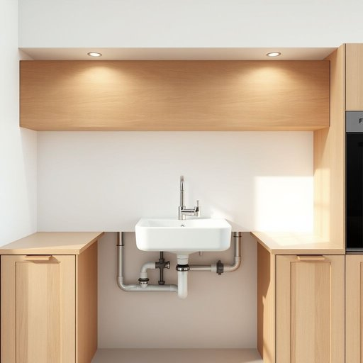

# plumbing

<h1 style="font-size: 2.5em; font-weight: 300; letter-spacing: 2px; margin: 0; color: #2c3e50;">
/ˈpləmɪŋ/
</h1>

---

---

## 例句

Before we decide to renovate the kitchen, it’s crucial to have a professional check the plumbing, which, if faulty or outdated, could cause leaks, water pressure issues, or even more serious damage that might end up costing us a fortune to fix later on.

*Before(/ˌbiˈfɔr/) we(/wi/) decide(/ˌdɪˈsaɪd/) to(/tɪ/) renovate(/ˈrɛnəˌveɪt/) the(/ðə/) kitchen,(/ˈkɪʧən,/) it’s(/it’s*/) crucial(/ˈkruʃəl/) to(/tɪ/) have(/hæv/) a(/ə/) professional(/prəˈfɛʃənəl/) check(/ʧɛk/) the(/ðə/) plumbing,(/ˈpləmɪŋ,/) which,(/wɪʧ,/) if(/ɪf/) faulty(/ˈfɔlti/) or(/ər/) outdated,(/ˈaʊtˌdeɪtɪd,/) could(/kʊd/) cause(/kɔz/) leaks,(/liks,/) water(/ˈwɔtər/) pressure(/ˈprɛʃər/) issues,(/ˈɪʃuz,/) or(/ər/) even(/ˈivɪn/) more(/mɔr/) serious(/ˈsɪriəs/) damage(/ˈdæmɪʤ/) that(/ðət/) might(/maɪt/) end(/ɛnd/) up(/əp/) costing(/ˈkɔstɪŋ/) us(/ˈjuˈɛs/) a(/ə/) fortune(/ˈfɔrʧən/) to(/tɪ/) fix(/fɪks/) later(/ˈleɪtər/) on.(/ɔn./)*

**翻译：** 在决定翻新厨房之前，务必请专业人员检查下水管道。若管道存在故障或陈旧，可能导致漏水、水压异常，甚至更严重的损害，届时修复费用可能高得惊人。

---

## 解释

英语单词“plumbing”作为名词在家居生活用品领域通常指的是建筑物内部自来水管道系统及其相关装置，用以输送饮用水、排放污水和废水，涉及管道、阀门、水龙头、排水口等设施。具体使用场合多见于描述住宅、商业建筑的水管安装、维修或改造，比如“the plumbing in this house needs repair”（这所房子的管道需要维修）。语言学习者应该注意“plumbing”是不可数名词，常与动词连用如“fix the plumbing”（修理管道），“check the plumbing”（检查管道）等，常见搭配包括“plumbing system”（管道系统）、“plumbing fixtures”（管道装置）、“plumbing problems”（管道问题）等。词源上，“plumbing”源自拉丁语“plumbum”，意为铅，因为古代管道多用铅制，后发展为泛指水管系统。中文中，“plumbing”准确译为“管道系统”或“管道设施”，重点指家居中的水管安装及维护，与单纯的“水管”或“管子”不同，涵盖整个供水排水体系。从文化角度看，plumbing在英语国家日常生活中极为重要，良好的plumbing系统象征现代生活便利和卫生水平，无特定褒贬色彩，但在描述管道故障时则带有负面意义，通常提示急需修理以避免生活不便。

---

<small style="color: #999; font-size: 0.9em;">2025-07-17 06:22:40</small>

