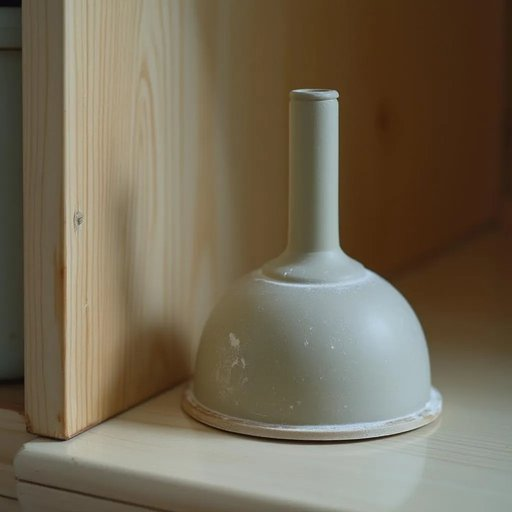

# plunger

<h1 style="font-size: 2.5em; font-weight: 300; letter-spacing: 2px; margin: 0; color: #2c3e50;">
/ˈplənʤər/
</h1>

---

---

## 例句

Whenever the sink started draining slowly, my mum would insist on grabbing the old, worn-out plunger from under the cabinet, which, despite its shabby appearance and rubbery smell, remarkably managed to dislodge whatever blockage was causing the water to stagnate, much to everyone's relief.

*Whenever(/wɛˈnɛvər/) the(/ðə/) sink(/sɪŋk/) started(/ˈstɑrtɪd/) draining(/ˈdreɪnɪŋ/) slowly,(/sˈloʊli,/) my(/maɪ/) mum(/məm/) would(/wʊd/) insist(/ˌɪnˈsɪst/) on(/ɔn/) grabbing(/ˈgræbɪŋ/) the(/ðə/) old,(/oʊld,/) worn-out(/worn-out*/) plunger(/ˈplənʤər/) from(/frəm/) under(/ˈəndər/) the(/ðə/) cabinet,(/ˈkæbənət,/) which,(/wɪʧ,/) despite(/dɪˈspaɪt/) its(/ɪts/) shabby(/ˈʃæbi/) appearance(/əˈpɪrəns/) and(/ənd/) rubbery(/ˈrəbəri/) smell,(/smɛl,/) remarkably(/rɪˈmɑrkəbli/) managed(/ˈmænɪʤd/) to(/tɪ/) dislodge(/dɪsˈlɑʤ/) whatever(/ˌwəˈtɛvər/) blockage(/ˈblɑkɪʤ/) was(/wɑz/) causing(/ˈkɔzɪŋ/) the(/ðə/) water(/ˈwɔtər/) to(/tɪ/) stagnate,(/ˈstægˌneɪt,/) much(/məʧ/) to(/tɪ/) everyone's(/ˈɛvriˌwənz/) relief.(/rɪˈlif./)*

**翻译：** 每当水槽开始排水变慢时，妈妈总是坚持去橱柜底下取出那只旧得破烂的皮搋子，尽管它外表粗糙、带着橡胶味，却奇迹般地成功疏通了堵塞，让大家都松了一口气。

---

## 解释

英语单词“plunger”在家居生活用品语境中作为名词，主要指“活塞吸盘”或“马桶吸盘”，是一种用于疏通堵塞管道的工具，常见于厕所或水槽。具体使用场合通常是在下水道、马桶或水槽堵塞时，用吸盘端施加压力，通过吸力使堵塞物松动，以恢复排水通畅。英语学习者使用该词时应注意其通常与动词“use”搭配，如“use a plunger”，或与形容词连用描述工具的状态，例如“rubber plunger”（橡胶吸盘）；此外，它多作为可数名词出现，复数形式为“plungers”。词源上，“plunger”源自动词“plunge”，意指“突然插入或下压”，形象地描绘了该工具使用时用力压下、水流冲入的动作。中文语境中，“plunger”通常准确翻译为“活塞吸盘”或“马桶吸盘”，也有时简称为“吸盘”，强调其功能性工具属性，没有特别的褒贬色彩，属于实用工具类词汇，且在家庭日常用语中较为常见和基础，使用时无需担心文化上的误会或特殊内涵。

---

<small style="color: #999; font-size: 0.9em;">2025-07-17 06:22:40</small>

