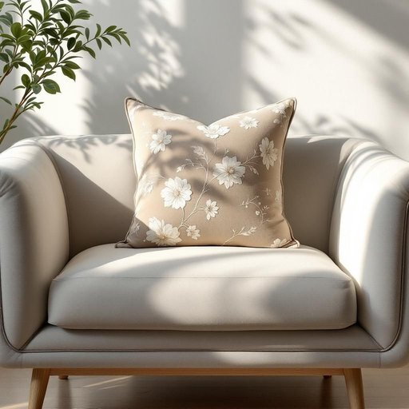

# plush

<h1 style="font-size: 2.5em; font-weight: 300; letter-spacing: 2px; margin: 0; color: #2c3e50;">
/pləʃ/
</h1>

---

---

## 例句

Could you please pass me the plush from the living room shelf, the one with the floral pattern and extra cushioning, so I can make the sofa look more inviting before our guests arrive this evening?

*Could(/kʊd/) you(/ju/) please(/pliz/) pass(/pæs/) me(/mi/) the(/ðə/) plush(/pləʃ/) from(/frəm/) the(/ðə/) living(/ˈlɪvɪŋ/) room(/rum/) shelf,(/ʃɛlf,/) the(/ðə/) one(/wən/) with(/wɪθ/) the(/ðə/) floral(/ˈflɔrəl/) pattern(/ˈpætərn/) and(/ənd/) extra(/ˈɛkstrə/) cushioning,(/ˈkʊʃənɪŋ,/) so(/soʊ/) I(/aɪ/) can(/kən/) make(/meɪk/) the(/ðə/) sofa(/ˈsoʊfə/) look(/lʊk/) more(/mɔr/) inviting(/ˌɪnˈvaɪtɪŋ/) before(/ˌbiˈfɔr/) our(/ɑr/) guests(/gɛsts/) arrive(/əraɪv/) this(/ðɪs/) evening?(/ˈivnɪŋ?/)*

**翻译：** 请帮我从客厅的架子上拿那个带花纹且加了厚垫子的毛绒垫，好让我在今晚客人到来之前，把沙发布置得更舒适宜人。

---

## 解释

英语单词plush在家居生活用品领域作为名词时，通常指一种质地柔软且有绒毛感的织物，常用于制作沙发、靠垫、毯子或玩具等，强调其舒适和豪华的触感。这一用法多见于描述室内装饰材料或家具表层的场合，如“一张覆盖有绒布的沙发”。英语学习者在使用该词时需注意，plush作为名词时通常不可数，表示材料或织物，而作为形容词时则形容物品柔软豪华，如“豪华绒面织物”，常见搭配包括plush fabric、plush toy等。此外，plush在句中多作名词或形容词使用，语法上需结合上下文确定词性。plush一词源自19世纪早期，源自法语peluche意为柔软的毛绒，其词根可追溯至拉丁语pilus，意指毛发，体现出其织物质地的特点。在中文语境中，plush准确翻译为绒布或毛绒，指触感柔软且带绒毛的织物，用于突出家居用品的舒适感和质感，常带有一定的豪华或高档意味，因而在描述家居产品时多带褒义色彩，不带负面或贬义含义。

---

<small style="color: #999; font-size: 0.9em;">2025-07-17 06:22:40</small>

