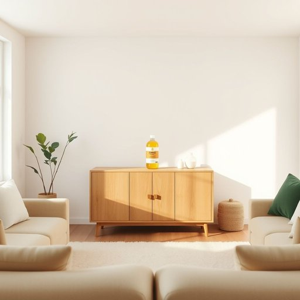

# polish

<h1 style="font-size: 2.5em; font-weight: 300; letter-spacing: 2px; margin: 0; color: #2c3e50;">
/ˈpɑlɪʃ/
</h1>

---

---

## 例句

Before we start rearranging the furniture in the living room, could you please grab the wood polish from the cupboard, the one with the lemon scent, since it’s the only product that not only restores the shine but also protects the surface from scratches and water damage?

*Before(/ˌbiˈfɔr/) we(/wi/) start(/stɑrt/) rearranging(/ˌriərˈeɪnʤɪŋ/) the(/ðə/) furniture(/ˈfərnɪʧər/) in(/ɪn/) the(/ðə/) living(/ˈlɪvɪŋ/) room,(/rum,/) could(/kʊd/) you(/ju/) please(/pliz/) grab(/græb/) the(/ðə/) wood(/wʊd/) polish(/ˈpɑlɪʃ/) from(/frəm/) the(/ðə/) cupboard,(/ˈkəbərd,/) the(/ðə/) one(/wən/) with(/wɪθ/) the(/ðə/) lemon(/ˈlɛmən/) scent,(/sɛnt,/) since(/sɪns/) it’s(/it’s*/) the(/ðə/) only(/ˈoʊnli/) product(/ˈprɑdəkt/) that(/ðət/) not(/nɑt/) only(/ˈoʊnli/) restores(/rɪˈstɔrz/) the(/ðə/) shine(/ʃaɪn/) but(/bət/) also(/ˈɔlsoʊ/) protects(/prəˈtɛkts/) the(/ðə/) surface(/ˈsərfəs/) from(/frəm/) scratches(/ˈskræʧɪz/) and(/ənd/) water(/ˈwɔtər/) damage?(/ˈdæmɪʤ?/)*

**翻译：** 在我们开始重新布置客厅家具之前，能否请你从橱柜里拿出那瓶带柠檬香味的木材抛光剂？它不仅能恢复光泽，还能保护表面免受刮擦和水渍的损害，是唯一合适的产品。

---

## 解释

英语单词"polish"作为名词，在家居生活用品的语境中通常指用于清洁、打磨和保护家具、地板、金属或其他表面的一种抛光剂或光亮剂，常见的有家具抛光剂（furniture polish）、鞋油（shoe polish）等。使用时多出现在如"apply polish to the wood"（在木材上涂抹抛光剂）或"this shoe polish makes leather shine"（这种鞋油能让皮革发亮）的表达中。语法上，"polish"作为名词是不可数名词，但在指具体品牌或种类时也可用作可数名词，如“two different polishes”。其常见搭配包括动词apply、use、buy，形容词wooden、shoe、metal等，英语学习者应注意区分"polish"名词与动词的读音不同，名词读作/ˈpɒlɪʃ/（第一音节重读），动词读作/ˈpɒlɪʃ/但语调略有区别。该词源自拉丁语"polire"，意指“磨光、抛光”，经过法语"polir"传入英语，含义核心均为“使表面光滑或有光泽”。在中文语境中，“polish”作为名词应准确理解为“抛光剂”、“擦光剂”或“光亮剂”，避免与其动词意思混淆，不含贬义，通常带有积极意义，反映物品经过处理后的光洁度和美观效果。在文化上，使用polish产品体现了对家居或个人物品保养的细致与讲究，具有实用与美学双重价值。

---

<small style="color: #999; font-size: 0.9em;">2025-07-17 06:22:40</small>

