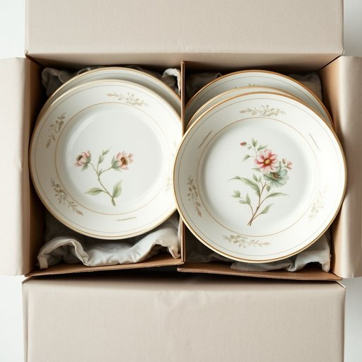

# porcelain

<h1 style="font-size: 2.5em; font-weight: 300; letter-spacing: 2px; margin: 0; color: #2c3e50;">
/ˈpɔrsələn/
</h1>

---

---

## 例句

I carefully packed the delicate porcelain plates, which had intricate hand-painted floral designs and had been passed down through generations, into the padded boxes before the movers arrived to ensure they wouldn’t chip or crack during the house relocation.

*I(/aɪ/) carefully(/ˈkɛrfəli/) packed(/pækt/) the(/ðə/) delicate(/ˈdɛləkət/) porcelain(/ˈpɔrsələn/) plates,(/pleɪts,/) which(/wɪʧ/) had(/hæd/) intricate(/ˈɪntrəkət/) hand-painted(/hand-painted*/) floral(/ˈflɔrəl/) designs(/dɪˈzaɪnz/) and(/ənd/) had(/hæd/) been(/bɪn/) passed(/pæst/) down(/daʊn/) through(/θru/) generations,(/ˌʤɛnərˈeɪʃənz,/) into(/ˈɪntu/) the(/ðə/) padded(/ˈpædɪd/) boxes(/ˈbɑksɪz/) before(/ˌbiˈfɔr/) the(/ðə/) movers(/ˈmuvərz/) arrived(/əraɪvd/) to(/tɪ/) ensure(/ɪnˈʃʊr/) they(/ðeɪ/) wouldn’t(/wouldn’t*/) chip(/ʧɪp/) or(/ər/) crack(/kræk/) during(/ˈdʊrɪŋ/) the(/ðə/) house(/haʊs/) relocation.(/ˌriˈloʊˈkeɪʃən./)*

**翻译：** 我小心地将那些拥有精美手绘花卉图案、历代相传的精致瓷盘装入带衬垫的盒子中，确保它们在搬家过程中不被磕碰或破损，等待搬运工的到来。

---

## 解释

“porcelain”作为名词，在家居生活用品的语境中通常指一种质地细腻、坚硬且半透明的瓷器，常用于制作餐具、茶具、花瓶等高档生活用品。具体使用场合多见于描述陶瓷制品的材质与品质时，如“porcelain dinnerware”（瓷制餐具）、“porcelain vase”（瓷花瓶）等，强调其优雅、美观及耐用的特性。英语学习者在使用该词时需注意其不可数名词的属性，通常用作泛指，若指特定的一件瓷器，则前面需加限定词如“a piece of porcelain”。常见搭配包括porcelain tableware（瓷器餐具）、porcelain tiles（瓷砖）等。词源方面，“porcelain”源自意大利语“porcellana”，意指“贝壳”，因早期欧洲人认为这种瓷器的光滑质感类似贝壳而得名，且通过传播最终进入英语。中文语境中，“porcelain”准确对应“瓷器”，强调其为经过高温烧制的精致陶瓷制品，与“陶器”或“陶瓷”相比，“瓷器”更突出质地细腻和具半透明性。在文化层面，瓷器素有“白色黄金”之称，是中国传统的代表性工艺品，因其美观和实用性，常带有一定的艺术与收藏价值，需要注意在表达中保持其高雅和精致的语义色彩，没有明显贬义，在日常用语及专业领域均属中性词。

---

<small style="color: #999; font-size: 0.9em;">2025-07-17 06:22:40</small>

