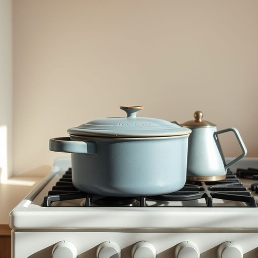

# pot

<h1 style="font-size: 2.5em; font-weight: 300; letter-spacing: 2px; margin: 0; color: #2c3e50;">
/pɑt/
</h1>

---

---

## 例句

Could you please pass me the blue pot that's sitting next to the kettle on the stove, the one with the chipped handle and the scratched lid, because I need to boil some water for the tea before our guests arrive?

*Could(/kʊd/) you(/ju/) please(/pliz/) pass(/pæs/) me(/mi/) the(/ðə/) blue(/blu/) pot(/pɑt/) that's(/ðæts/) sitting(/ˈsɪtɪŋ/) next(/nɛkst/) to(/tɪ/) the(/ðə/) kettle(/ˈkɛtəl/) on(/ɔn/) the(/ðə/) stove,(/stoʊv,/) the(/ðə/) one(/wən/) with(/wɪθ/) the(/ðə/) chipped(/ʧɪpt/) handle(/ˈhændəl/) and(/ənd/) the(/ðə/) scratched(/skræʧt/) lid,(/lɪd,/) because(/bɪˈkəz/) I(/aɪ/) need(/nid/) to(/tɪ/) boil(/bɔɪl/) some(/səm/) water(/ˈwɔtər/) for(/fər/) the(/ðə/) tea(/ti/) before(/ˌbiˈfɔr/) our(/ɑr/) guests(/gɛsts/) arrive?(/əraɪv?/)*

**翻译：** 请你把炉子上壶旁边那个蓝色的锅递给我，就是那个锅柄有点崩缺、锅盖上带着划痕的，因为我需要烧水泡茶，客人们到来之前准备一下。

---

## 解释

英语单词“pot”作为名词在家居生活用品语境中主要指容器类物品，通常是指用来盛水、煮食物或种植花草的器皿，比如厨房里的炖锅、煮锅或花盆等。具体使用场合包括烹饪时说的“a cooking pot”（炖锅），园艺时说的“a flower pot”（花盆），或者储物时说的“a pot of tea”（一壶茶，此处pot引申为“壶”）。英语学习者使用“pot”时需注意其不可数和可数用法的区别，通常“pot”作为容器是可数名词，可以用复数形式“pots”，形容词搭配常见如“large pot”、“small pot”、“ceramic pot”等。此外，“pot”常与介词构成短语，如“in a pot”（在锅里）、“out of the pot”（锅外），表达动作发生的具体位置。词源上，“pot”源自古英语“pott”，最早用于指盛水或食物的陶罐，历史悠久，与许多欧洲语言中的类似词根相关，反映了其作为罐状容器的基本属性。中文中“pot”在家居生活用品场景下准确翻译通常为“锅”、“壶”或“盆”，依据具体语境而定，如烹饪用多译为“锅”，种植用则译为“花盆”或“盆”，这一翻译强调了器皿的功能。需要注意的是，“pot”在英美文化中并无贬义倾向，但在非正式口语中“pot”可指代“大麻”，此为俚语用法，与家居用品无关，学习者需加以区分。总体来看，“pot”是日常生活中常见且实用的名词，其基本意义明确且易于掌握。

---

<small style="color: #999; font-size: 0.9em;">2025-07-17 06:22:40</small>

