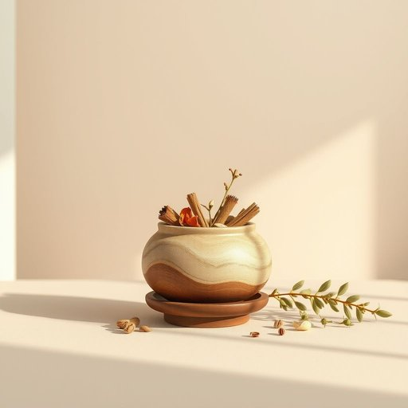

# potpourri

<h1 style="font-size: 2.5em; font-weight: 300; letter-spacing: 2px; margin: 0; color: #2c3e50;">
/ˌpoʊpʊˈri/
</h1>

---

---

## 例句

Despite the chaos of the meeting, the speaker’s eloquence on the topic of justice inspired a deep and meaningful discussion among the participants, who all acknowledged the importance of fairness in both personal and professional contexts.

*Despite(/dɪˈspaɪt/) the(/ðə/) chaos(/keɪɑs/) of(/əv/) the(/ðə/) meeting,(/ˈmitɪŋ,/) the(/ðə/) speaker’s(/speaker’s*/) eloquence(/ˈɛləkwəns/) on(/ɔn/) the(/ðə/) topic(/ˈtɑpɪk/) of(/əv/) justice(/ˈʤəstɪs/) inspired(/ˌɪnˈspaɪərd/) a(/ə/) deep(/dip/) and(/ənd/) meaningful(/ˈminɪŋfəl/) discussion(/dɪˈskəʃən/) among(/əˈməŋ/) the(/ðə/) participants,(/pɑrˈtɪsəpənts,/) who(/hu/) all(/ɔl/) acknowledged(/ækˈnɑlɪʤd/) the(/ðə/) importance(/ˌɪmˈpɔrtəns/) of(/əv/) fairness(/ˈfɛrnəs/) in(/ɪn/) both(/boʊθ/) personal(/ˈpərsɪnəl/) and(/ənd/) professional(/prəˈfɛʃənəl/) contexts.(/ˈkɑnˌtɛksts./)*

**翻译：** 尽管会议一片混乱，演讲者关于正义主题的精彩表达却激发了与会者之间深入而富有意义的讨论，大家一致认可公平在个人和职业领域中的重要性。

---

## 解释

英语单词“potpourri”作为名词，在家居生活用品的语境中通常指一种由干燥的花瓣、树皮和香料混合而成的芳香物，用于散发室内香味，常见于客厅、卧室或浴室的装饰摆设中，目的是提升居家环境的舒适度和美感。使用时，英语学习者需注意“potpourri”为不可数名词，虽然偶尔也可见复数形式“potpourris”，但主要用单数表达整体的混合物，常搭配“a bowl of potpourri”（一碗干花香料）或“a sachet of potpourri”（一袋干花香料）等短语。该词源自法语“pot-pourri”，原意为“坏锅”或“混杂锅”，最初指混合多种烹饪材料的杂锅，后引申为各种不同元素的混合物，用于形容干花香料混合物时，强调了其多样且和谐融合的特性。在中文语境中，“potpourri”一般准确翻译为“干花香料”或“香料包”，强调其装饰性和香氛功能，无明显褒贬色彩，但在文化感知上多与优雅、温馨的居家环境联系紧密，具有一定的美学和生活品质的象征意味。

---

<small style="color: #999; font-size: 0.9em;">2025-07-17 06:22:40</small>

