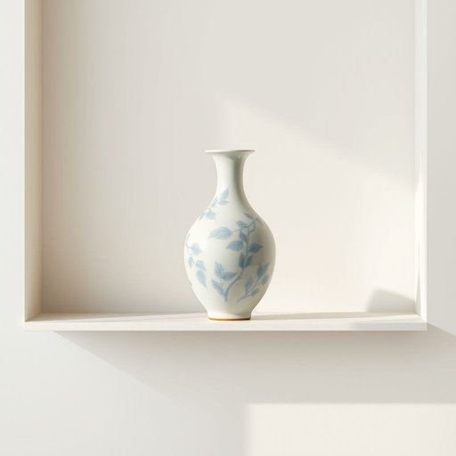

# pottery

<h1 style="font-size: 2.5em; font-weight: 300; letter-spacing: 2px; margin: 0; color: #2c3e50;">
/ˈpɑtəri/
</h1>

---

---

## 例句

The intricate vase, a stunning example of ancient pottery, was carefully placed on the shelf to highlight its delicate craftsmanship and vibrant blue patterns.

*The(/ðə/) intricate(/ˈɪntrəkət/) vase,(/vɑz,/) a(/ə/) stunning(/ˈstənɪŋ/) example(/ɪgˈzæmpəl/) of(/əv/) ancient(/ˈeɪnʧənt/) pottery,(/ˈpɑtəri,/) was(/wɑz/) carefully(/ˈkɛrfəli/) placed(/pleɪst/) on(/ɔn/) the(/ðə/) shelf(/ʃɛlf/) to(/tɪ/) highlight(/ˈhaɪˌlaɪt/) its(/ɪts/) delicate(/ˈdɛləkət/) craftsmanship(/ˈkræftsmənˌʃɪp/) and(/ənd/) vibrant(/ˈvaɪbrənt/) blue(/blu/) patterns.(/ˈpætərnz./)*

**翻译：** 这只复杂精美的花瓶，是古代陶艺的惊艳典范，被精心安放在架子上，彰显其细腻的工艺和鲜艳的蓝色纹饰。

---

## 解释

英语单词pottery作为名词，在家居生活用品的语境中主要指由陶土制成的器皿，如碗、盘、花瓶等手工或工业制成的陶器，通常用于装饰或实用。具体使用场合多见于描述家庭装饰、厨房用具、艺术收藏品或陶瓷工艺品时，例如a collection of pottery on the shelf（架子上的陶器收藏）或handmade pottery dishes（手工制作的陶瓷餐具）。学习者需注意，pottery是不可数名词，不能直接用复数形式potteries，表示多个陶器时通常用pieces of pottery或pottery items等表达；此外，常见搭配有pottery workshop（陶艺工作坊）、pottery class（陶艺课）等，表达技巧上，多利用形容词修饰，如ancient pottery（古代陶器）。词源上，pottery源自中古英语，关联词根pot意指罐、壶，后衍生出制作陶器的工艺和陶器制品的整体概念。中文语境中，pottery准确翻译为陶器或陶瓷制品，侧重于指用粘土烧制的容器和工艺品，与瓷器相比更泛，有时在日常生活中陶器带有手工艺感和质朴文化气息，无明显褒贬色彩，但在艺术收藏或手工艺领域往往具有积极的文化价值和审美意义。

---

<small style="color: #999; font-size: 0.9em;">2025-07-17 06:22:40</small>

