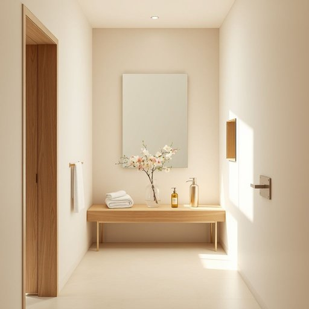

# powder-room

<h1 style="font-size: 2.5em; font-weight: 300; letter-spacing: 2px; margin: 0; color: #2c3e50;">
/powder-room*/
</h1>

---

---

## 例句

Before the guests arrived, Emma hurriedly checked the powder-room, which, despite being a small space adjacent to the hallway, was impeccably stocked with scented hand towels, elegant soap dispensers, and a delicate vase of fresh flowers to ensure everyone felt welcome and comfortable.

*Before(/ˌbiˈfɔr/) the(/ðə/) guests(/gɛsts/) arrived,(/əraɪvd,/) Emma(/ˈɛmə/) hurriedly(/ˈhəridli/) checked(/ʧɛkt/) the(/ðə/) powder-room,(/powder-room*,/) which,(/wɪʧ,/) despite(/dɪˈspaɪt/) being(/biɪŋ/) a(/ə/) small(/smɔl/) space(/speɪs/) adjacent(/əˈʤeɪsənt/) to(/tɪ/) the(/ðə/) hallway,(/ˈhɔlˌweɪ,/) was(/wɑz/) impeccably(/ˌɪmˈpɛkəbli/) stocked(/stɑkt/) with(/wɪθ/) scented(/ˈsɛntɪd/) hand(/hænd/) towels,(/taʊəlz,/) elegant(/ˈɛləgənt/) soap(/soʊp/) dispensers,(/dɪˈspɛnsərz,/) and(/ənd/) a(/ə/) delicate(/ˈdɛləkət/) vase(/vɑz/) of(/əv/) fresh(/frɛʃ/) flowers(/flaʊərz/) to(/tɪ/) ensure(/ɪnˈʃʊr/) everyone(/ˈɛvriˌwən/) felt(/fɛlt/) welcome(/ˈwɛlkəm/) and(/ənd/) comfortable.(/ˈkəmfərtəbəl./)*

**翻译：** 客人到来之前，艾玛匆忙检查了化妆间。尽管空间狭小，紧邻走廊，却陈设得井井有条，配备了芳香的毛巾、雅致的皂液瓶和一只盛放着鲜花的精致花瓶，以确保每位宾客都感到宾至如归、舒适惬意。

---

## 解释

“powder-room”作为名词，主要指代供女性使用的化妆间或洗手间，通常出现在较为正式或传统的家居环境和公共场所中，比如在宴会、聚会、餐厅或剧院里设立的专门供女士整理妆容和整理仪容的空间。从使用语境来看，powder-room带有一定的礼貌和优雅色彩，常用于较文雅或含蓄的表达中，而非直接说“bathroom”或“toilet”，因此在日常会话中多见于比较正式、礼貌或老式的场合。学习者在使用时应注意powder-room是一个复合名词，通常作为单数名词出现，可以与定冠词the连用，如the powder-room，且其指涉对象特定于女性使用的私密空间，故在表达时需要避免与公共卫生间或男士厕所混淆。常见搭配有“go to the powder-room”（去化妆间）、“visit the powder-room”等。此外，powder-room源于19世纪，原意为女性补妆用的房间，“powder”指的是用于化妆的脸粉，反映了那个时代女士注重外表打扮的社会习俗。词源体现了其功能与性别专属性，是一个带有一定历史背景和文化内涵的词汇。在中文语境中，powder-room通常被准确译为“化妆间”或“女士洗手间”，侧重于空间的私密性和化妆功能，而非纯粹的厕所或卫生间。因此，这一词汇的理解不仅包括其物理空间属性，也包含了文化上的礼貌和性别特征，使用时应避免直译成“厕所”，以防误解或失去其特有的优雅色彩。

---

<small style="color: #999; font-size: 0.9em;">2025-07-17 06:22:40</small>

