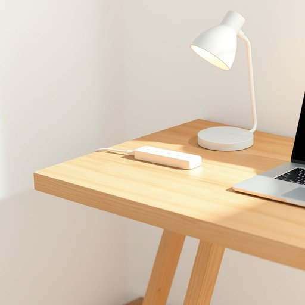

# power-strip

<h1 style="font-size: 2.5em; font-weight: 300; letter-spacing: 2px; margin: 0; color: #2c3e50;">
/power-strip*/
</h1>

---

---

## 例句

Could you please move the power-strip closer to the desk, since the current sockets are too far away, and I need to plug in both my laptop charger and the lamp, but also make sure it’s not overloaded with too many high-powered devices to avoid any risk of tripping the fuse?

*Could(/kʊd/) you(/ju/) please(/pliz/) move(/muv/) the(/ðə/) power-strip(/power-strip*/) closer(/ˈkloʊzər/) to(/tɪ/) the(/ðə/) desk,(/dɛsk,/) since(/sɪns/) the(/ðə/) current(/ˈkɑrənt/) sockets(/ˈsɑkəts/) are(/ər/) too(/tu/) far(/fɑr/) away,(/əˈweɪ,/) and(/ənd/) I(/aɪ/) need(/nid/) to(/tɪ/) plug(/pləg/) in(/ɪn/) both(/boʊθ/) my(/maɪ/) laptop(/ˈlæpˌtɑp/) charger(/ˈʧɑrʤər/) and(/ənd/) the(/ðə/) lamp,(/læmp,/) but(/bət/) also(/ˈɔlsoʊ/) make(/meɪk/) sure(/ʃʊr/) it’s(/it’s*/) not(/nɑt/) overloaded(/ˈoʊvərˌloʊdɪd/) with(/wɪθ/) too(/tu/) many(/ˈmɛni/) high-powered(/ˌhaɪˈpaʊərd/) devices(/dɪˈvaɪsɪz/) to(/tɪ/) avoid(/əˈvɔɪd/) any(/ˈɛni/) risk(/rɪsk/) of(/əv/) tripping(/ˈtrɪpɪŋ/) the(/ðə/) fuse?(/fjuz?/)*

**翻译：** 请您将插线板移近一点放到书桌附近，因为现有的插座太远了，我需要同时给笔记本电脑充电器和台灯供电，但也请确保不要接入过多大功率的电器，以免跳闸。

---

## 解释

英语单词“power-strip”作为名词，指的是一种带有多个插座的电源排插，通常用于同时为多个电子设备供电，常见于家庭、办公室等场合，比如在客厅、书房或工作台上连接台灯、电脑、手机充电器等。英语学习者在使用“power-strip”时需注意其为可数名词，复数形式为“power-strips”，且常与动词“plug in”搭配，如“plug the charger into the power-strip”，表示将设备插入排插。此外，表达“power-strip with surge protection”指带有防浪涌功能的排插，是较为常见的固定搭配。该词由“power”（电力）和“strip”（条、条状物）组成，起源于其外形类似条状且用于分配电源，20世纪中后期随着家用电器增多而普及。中文语境中，“power-strip”准确翻译为“排插”或“插线板”，强调其多孔插座和便于扩展电源的功能，无褒贬色彩，属于中性词汇，反映了现代家居生活中电力分配和使用的便利需求。

---

<small style="color: #999; font-size: 0.9em;">2025-07-17 06:22:40</small>

