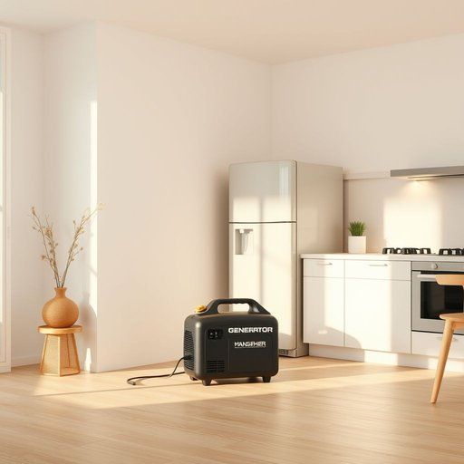

# power

<h1 style="font-size: 2.5em; font-weight: 300; letter-spacing: 2px; margin: 0; color: #2c3e50;">
/paʊər/
</h1>

---

---

## 例句

Despite the unexpected blackout last night, the portable power generator, which proved indispensable in maintaining essential appliances, kept the fridge running for hours while we cooked dinner using the gas hob.

*Despite(/dɪˈspaɪt/) the(/ðə/) unexpected(/ˌənɪkˈspɛktɪd/) blackout(/ˈblæˌkaʊt/) last(/læst/) night,(/naɪt,/) the(/ðə/) portable(/ˈpɔrtəbəl/) power(/paʊər/) generator,(/ˈʤɛnərˌeɪtər,/) which(/wɪʧ/) proved(/pruvd/) indispensable(/ˌɪndɪˈspɛnsəbəl/) in(/ɪn/) maintaining(/meɪnˈteɪnɪŋ/) essential(/ɛˈsɛnʃəl/) appliances,(/əˈplaɪənsɪz,/) kept(/kɛpt/) the(/ðə/) fridge(/frɪʤ/) running(/ˈrənɪŋ/) for(/fər/) hours(/aʊərz/) while(/waɪl/) we(/wi/) cooked(/kʊkt/) dinner(/ˈdɪnər/) using(/ˈjuzɪŋ/) the(/ðə/) gas(/gæs/) hob.(/hɑb./)*

**翻译：** 尽管昨晚突遇停电，便携式发电机在维持重要电器运转方面发挥了不可或缺的作用，使冰箱得以保持运行数小时，而我们则借助燃气灶顺利烹饪了晚餐。

---

## 解释

在家居生活用品的语境中，英语单词“power”作为名词主要指电力或能量，具体使用场合包括对家具电器如灯具、电视机、电冰箱等供电功能的描述，例如“power supply”（电源）、“power button”（电源开关）、“power outage”（停电）等。英语学习者在使用该词时需注意其作为不可数名词时指代抽象的能量或电力，常搭配如“electric power”（电力）、“power consumption”（功率消耗）、“power cord”（电源线）等；同时，“power”也可表示机器或装置的工作能力，如“power rating”（功率等级），语法上它通常用作单数名词，但在特定技术语境中也可用作复数。词源上，“power”源自古法语“povoir”，进一步追溯至拉丁语“potere”，意为能力或力量，反映其从一般意义上的“能力”逐渐具体化为“电力”这一现代意义。在中文语境中，“power”准确翻译为“电力”、“功率”或“动力”，根据具体情境而定，强调其作为生活用品中能源供应的基本属性。需要注意的是，“power”在技术和日常用语中没有明显褒贬含义，但在文化上电力象征着现代生活的便利和科技进步，因而具有积极的正面色彩。

---

<small style="color: #999; font-size: 0.9em;">2025-07-17 06:22:40</small>

