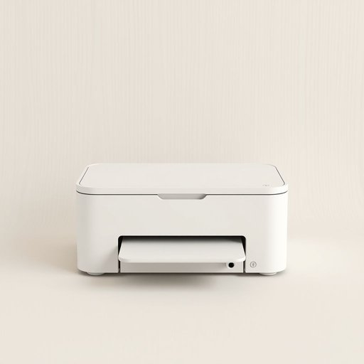

# printer

<h1 style="font-size: 2.5em; font-weight: 300; letter-spacing: 2px; margin: 0; color: #2c3e50;">
/ˈprɪnər/
</h1>

---

---

## 例句

Although the complexity of the project required meticulous planning and unprecedented collaboration among diverse teams, the overall success was attributed to the seamless integration of innovative technology and expert knowledge.

*Although(/ˌɔlˈðoʊ/) the(/ðə/) complexity(/kəmˈplɛksɪti/) of(/əv/) the(/ðə/) project(/ˈprɑʤɛkt/) required(/rikˈwaɪərd/) meticulous(/məˈtɪkjələs/) planning(/ˈplænɪŋ/) and(/ənd/) unprecedented(/ənˈprɛsɪˌdɛntɪd/) collaboration(/kəˌlæbərˈeɪʃən/) among(/əˈməŋ/) diverse(/dɪˈvərs/) teams,(/timz,/) the(/ðə/) overall(/ˈoʊvərˌɔl/) success(/səkˈsɛs/) was(/wɑz/) attributed(/əˈtrɪbjətəd/) to(/tɪ/) the(/ðə/) seamless(/ˈsimləs/) integration(/ˌɪnəˈgreɪʃən/) of(/əv/) innovative(/ˈɪnəˌveɪtɪv/) technology(/tɛkˈnɑləʤi/) and(/ənd/) expert(/ˈɛkspərt/) knowledge.(/ˈnɑlɪʤ./)*

**翻译：** 尽管项目的复杂性要求各团队之间进行细致的规划和前所未有的协作，但整体成功归功于创新技术与专业知识的无缝融合。

---

## 解释

英语单词“printer”在家居生活用品的语境中通常指的是连接电脑或其他电子设备，用于将电子文档、图片等内容通过喷墨、激光或热转印等方式打印到纸张上的设备。具体使用场合多见于家庭办公、学习打印作业或日常打印照片、信件等场景。英语学习者在使用“printer”作为名词时，应注意其复数形式为“printers”，且常见搭配包括“color printer”（彩色打印机）、“laser printer”（激光打印机）、“inkjet printer”（喷墨打印机）以及“printer cartridge”（打印机墨盒）等。此外，动词搭配如“to set up a printer”（安装打印机）、“to connect a printer”（连接打印机）、“to print from a printer”（使用打印机打印）等也较为常用。“Printer”一词源自拉丁语“premere”，意为“按压”，引申为机械印刷中的设备，随着技术发展从传统印刷机转指现代计算机打印设备。其中文翻译为“打印机”或“印表机”，在家居生活中理解为日常办公和学习必备的电子设备，没有特殊的褒贬含义或文化色彩，属于中性词汇。使用时需区分打印机与复印机、扫描仪等其他办公设备，避免混淆。

---

<small style="color: #999; font-size: 0.9em;">2025-07-17 06:22:40</small>

