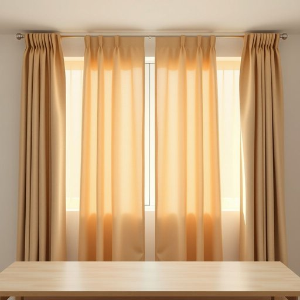

# privacy

<h1 style="font-size: 2.5em; font-weight: 300; letter-spacing: 2px; margin: 0; color: #2c3e50;">
/ˈpraɪvəsi/
</h1>

---

---

## 例句

In order to ensure maximum privacy while working from home, we've installed thick curtains that not only block out the street view but also help reduce noise, so that neither neighbours nor passersby can see or hear what’s going on inside.

*In(/ɪn/) order(/ˈɔrdər/) to(/tɪ/) ensure(/ɪnˈʃʊr/) maximum(/ˈmæksəməm/) privacy(/ˈpraɪvəsi/) while(/waɪl/) working(/ˈwərkɪŋ/) from(/frəm/) home,(/hoʊm,/) we've(/wiv/) installed(/ˌɪnˈstɔld/) thick(/θɪk/) curtains(/ˈkərtənz/) that(/ðət/) not(/nɑt/) only(/ˈoʊnli/) block(/blɑk/) out(/aʊt/) the(/ðə/) street(/strit/) view(/vju/) but(/bət/) also(/ˈɔlsoʊ/) help(/hɛlp/) reduce(/rɪˈdus/) noise,(/nɔɪz,/) so(/soʊ/) that(/ðət/) neither(/ˈniðər/) neighbours(/ˈneɪbərz/) nor(/nɔr/) passersby(/ˈpæsərzbi/) can(/kən/) see(/si/) or(/ər/) hear(/hir/) what’s(/what’s*/) going(/goʊɪŋ/) on(/ɔn/) inside.(/ˌɪnˈsaɪd./)*

**翻译：** 为了最大限度地保障居家办公时的隐私，我们安装了厚重的窗帘，不仅能有效遮挡外面的视线，还能降低噪音，使邻居和路人既看不见也听不到室内的情况。

---

## 解释

英语单词"privacy"作为名词在家居生活用品的语境中，主要指个人或家庭在居住空间内享有的私密性和不受打扰的状态，比如使用窗帘、隔断、门锁等用品以保障不被外界窥视或干扰。具体使用场合多见于讨论如何通过设计或物品配置保护居住者的个人空间，如“privacy curtain”（隐私帘）、“privacy screen”（隐私屏风）、“privacy lock”（隐私锁）的描述。英语学习者在使用"privacy"时应注意其为不可数名词，一般不加复数形式，且常与形容词“personal”（个人的）、“individual”（个体的）等搭配；常见表达还有“respect one’s privacy”（尊重某人隐私），“maintain privacy”（维持隐私），在句中通常作主语或宾语，后接固定搭配如“privacy concerns”（隐私问题）等。该词源自拉丁语“privatus”，意为私人的、不公开的，经过中古英语发展成为现代英语中的“privacy”，体现了对个人空间和信息的保护。中文中“privacy”准确理解为“隐私”或“私密”，强调个人生活空间的独立与安全性；在家居用品领域，往往带有积极正面的色彩，指保护个人生活不受干扰，但在特定文化背景下亦可能引发对安全、监控等方面的关注，具有一定的社会和文化内涵。

---

<small style="color: #999; font-size: 0.9em;">2025-07-17 06:22:40</small>

