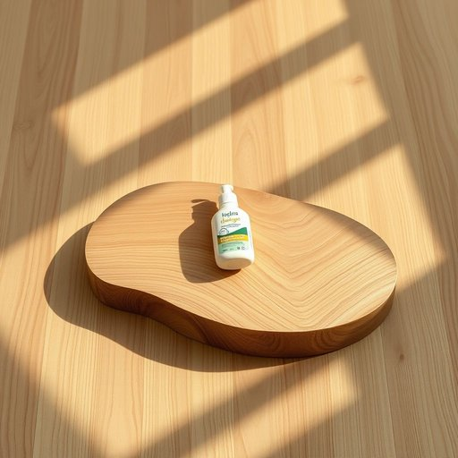

# product

<h1 style="font-size: 2.5em; font-weight: 300; letter-spacing: 2px; margin: 0; color: #2c3e50;">
/ˈprɑdəkt/
</h1>

---

---

## 例句

Before making a final decision, the thorough investigation of the product's effectiveness and potential allergens in reviews provided crucial information for ensuring household safety and protecting wooden furniture.

*Before(/ˌbiˈfɔr/) making(/ˈmeɪkɪŋ/) a(/ə/) final(/ˈfaɪnəl/) decision,(/dɪˈsɪʒən,/) the(/ðə/) thorough(/θəroʊ/) investigation(/ˌɪnˌvɛstəˈgeɪʃən/) of(/əv/) the(/ðə/) product's(/ˈprɑdəkts/) effectiveness(/ˈifɛktɪvnəs/) and(/ənd/) potential(/pəˈtɛnʃəl/) allergens(/ˈælərʤənz/) in(/ɪn/) reviews(/rəvˈjuz/) provided(/prəˈvaɪdɪd/) crucial(/ˈkruʃəl/) information(/ˌɪnˌfɔrˈmeɪʃən/) for(/fər/) ensuring(/ɪnˈʃʊrɪŋ/) household(/ˈhaʊsˌhoʊld/) safety(/ˈseɪfti/) and(/ənd/) protecting(/prəˈtɛktɪŋ/) wooden(/ˈwʊdən/) furniture.(/ˈfərnɪʧər./)*

**翻译：** 在做出最终决定之前，对产品效果及评论中潜在过敏原的详细调查，提供了确保家庭安全和保护木质家具的重要信息。

---

## 解释

英语单词product在家居生活用品场景中作为名词通常指制造或销售的具体物品比如家具厨具清洁用品等各种可供消费者购买和使用的家用商品在具体使用场合中常见的表达有household products家居用品cleaning products清洁产品kitchen products厨房用品等语境多涉及市场销售商品介绍购物指南等英语学习者在使用product时需要注意其可数性质通常用复数形式products表示多种商品且常见搭配包括product line产品系列product features产品特点product quality产品质量等此外表示产品的归属或特点时常用形容词或名词作定语如eco-friendly products环保产品product源自拉丁语productum意为向前带来或产生的东西暗示其为制造或加工后产生的实体物品在中文语境中product准确译为产品或商品在家居生活用品领域通常指用户可直接购买使用的实际物件强调其商业属性和功能性该词无明显褒贬色彩属于中性词汇但在不同语境中如defective product次品则带有负面含义文化上product凸显现代消费社会中商品化的特征反映出商品多样化和市场竞争的现实总体而言掌握product的正确语境和搭配有助于学习者准确表达与家居用品相关的内容

---

<small style="color: #999; font-size: 0.9em;">2025-07-17 06:22:40</small>

