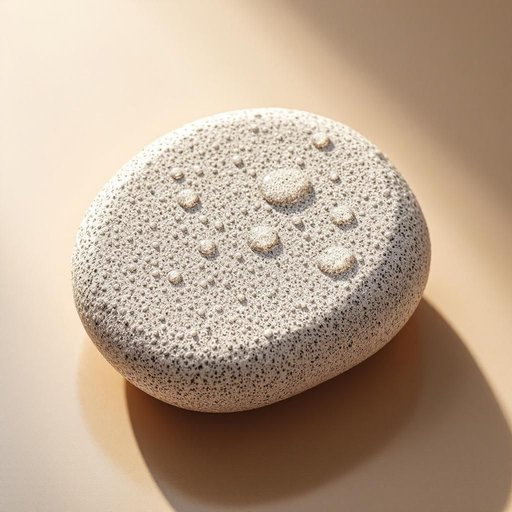

# pumice

<h1 style="font-size: 2.5em; font-weight: 300; letter-spacing: 2px; margin: 0; color: #2c3e50;">
/ˈpəməs/
</h1>

---

---

## 例句

When I was scrubbing the stubborn stains off the bathtub this morning, I realised that the pumice, which usually works wonders on tough grime without scratching the surface, was actually much more effective when used with a bit of warm water and gentle circular motions, making the whole cleaning process surprisingly quick and satisfying.

*When(/wɪn/) I(/aɪ/) was(/wɑz/) scrubbing(/ˈskrəbɪŋ/) the(/ðə/) stubborn(/ˈstəbərn/) stains(/steɪnz/) off(/ɔf/) the(/ðə/) bathtub(/ˈbæθtəb/) this(/ðɪs/) morning,(/ˈmɔrnɪŋ,/) I(/aɪ/) realised(/ˈriəˌlaɪzd/) that(/ðət/) the(/ðə/) pumice,(/ˈpəməs,/) which(/wɪʧ/) usually(/ˈjuʒəwəli/) works(/wərks/) wonders(/ˈwəndərz/) on(/ɔn/) tough(/təf/) grime(/graɪm/) without(/wɪˈθaʊt/) scratching(/ˈskræʧɪŋ/) the(/ðə/) surface,(/ˈsərfəs,/) was(/wɑz/) actually(/ˈæˌkʧuəli/) much(/məʧ/) more(/mɔr/) effective(/ˈifɛktɪv/) when(/wɪn/) used(/juzd/) with(/wɪθ/) a(/ə/) bit(/bɪt/) of(/əv/) warm(/wɔrm/) water(/ˈwɔtər/) and(/ənd/) gentle(/ˈʤɛnəl/) circular(/ˈsərkjələr/) motions,(/ˈmoʊʃənz,/) making(/ˈmeɪkɪŋ/) the(/ðə/) whole(/hoʊl/) cleaning(/ˈklinɪŋ/) process(/ˈprɔˌsɛs/) surprisingly(/səˈpraɪzɪŋli/) quick(/kwɪk/) and(/ənd/) satisfying.(/ˈsætɪsˌfaɪɪŋ./)*

**翻译：** 今天早上我在擦洗浴缸上顽固的污渍时，发现通常能有效去除顽垢且不刮伤表面的浮石，配合温水和轻柔的圆周运动使用时，效果更加显著，使整个清洁过程出奇地迅速且令人满意。

---

## 解释

英语单词“pumice”作为名词，指的是天然轻石或浮石，这种岩石质地多孔且轻盈，常用于家居生活用品中，尤其是在浴室或清洁领域，比如用作去角质的浮石块来擦拭人体皮肤、去除死皮，也可用于清洁顽固污渍。具体使用场合多见于个人护理、家居清洁或园艺中，语境通常涉及材料质感、清洁工具或美容用品。英语学习者需要注意“pumice”是不可数名词，通常不用复数形式；在表达中常见搭配如“pumice stone”（浮石），这是固定搭配，意指用于去角质的石块。此外，短语“use a pumice stone to scrub”表示用浮石擦洗。词源方面，“pumice”源自拉丁语“pumex”，意为多孔的石头，反映了其轻质多孔的特性，经过法语传入英语。在中文语境中，“pumice”准确翻译为“浮石”或“浮岩”，当专指家居生活用品时多译为“浮石块”或“去角质浮石”，强调其去死皮的功能。这个词一般无褒贬含义，属于中性词汇，但在美容与清洁语境中带有积极的实用和健康护理色彩，因其天然和环保属性而被看作一种自然材料，其文化内涵偏向实用、健康和自然美学。

---

<small style="color: #999; font-size: 0.9em;">2025-07-17 06:22:40</small>

