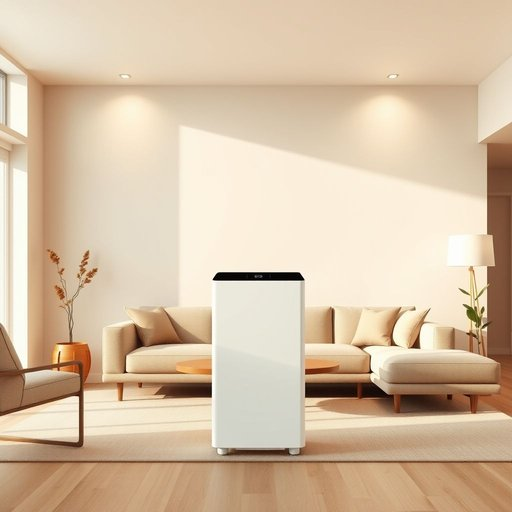

# purifier

<h1 style="font-size: 2.5em; font-weight: 300; letter-spacing: 2px; margin: 0; color: #2c3e50;">
/ˈpjʊrəˌfaɪər/
</h1>

---

---

## 例句

Ever since we installed the new air purifier in the living room, which not only filters out dust and pollen but also eliminates unpleasant cooking smells and airborne bacteria, I have noticed a significant improvement in the overall freshness and quality of the air we breathe at home.

*Ever(/ˈɛvər/) since(/sɪns/) we(/wi/) installed(/ˌɪnˈstɔld/) the(/ðə/) new(/nu/) air(/ɛr/) purifier(/ˈpjʊrəˌfaɪər/) in(/ɪn/) the(/ðə/) living(/ˈlɪvɪŋ/) room,(/rum,/) which(/wɪʧ/) not(/nɑt/) only(/ˈoʊnli/) filters(/ˈfɪltərz/) out(/aʊt/) dust(/dəst/) and(/ənd/) pollen(/ˈpɑlən/) but(/bət/) also(/ˈɔlsoʊ/) eliminates(/ɪˈlɪməˌneɪts/) unpleasant(/ənˈplɛzənt/) cooking(/ˈkʊkɪŋ/) smells(/smɛlz/) and(/ənd/) airborne(/ˈɛrˌbɔrn/) bacteria,(/bækˈtɪriə,/) I(/aɪ/) have(/hæv/) noticed(/ˈnoʊtɪst/) a(/ə/) significant(/sɪgˈnɪfɪkənt/) improvement(/ˌɪmˈpruvmənt/) in(/ɪn/) the(/ðə/) overall(/ˈoʊvərˌɔl/) freshness(/ˈfrɛʃnəs/) and(/ənd/) quality(/kˈwɑləti/) of(/əv/) the(/ðə/) air(/ɛr/) we(/wi/) breathe(/brið/) at(/æt/) home.(/hoʊm./)*

**翻译：** 自从我们在客厅安装了那台新空气净化器后，它不仅能过滤灰尘和花粉，还能消除难闻的厨房异味和空气中的细菌，我明显感觉到家中空气的清新度和质量有了显著提升。

---

## 解释

英语单词“purifier”在家居生活用品的语境中通常指用于净化空气、水或其他介质的设备，如空气净化器或净水器，常见于家庭、办公室等室内环境中，用以改善生活质量。例如，空气净化器可以去除空气中的灰尘、花粉、异味和有害气体，提升室内空气清新度。学习者在使用“purifier”作为名词时需注意其不可数性质通常不适用，且常与“air”（空气）、“water”（水）等名词搭配形成固定短语，如“air purifier”（空气净化器）、“water purifier”（净水器）。此外，其复数形式为“purifiers”，符合普通名词的复数规则。该词源自拉丁语“purificare”，意为“净化”，由“puri-”（纯净）和“-ficare”（使成为）构成，寓意通过某种过程使物质纯净无杂质。在中文语境中，“purifier”恰当的翻译为“净化器”，突出其功能性设备属性，没有褒贬含义，属于中性词汇，体现现代家居生活中对健康、环保的关注，反映了人们对洁净环境的追求与需求。

---

<small style="color: #999; font-size: 0.9em;">2025-07-17 06:22:40</small>

