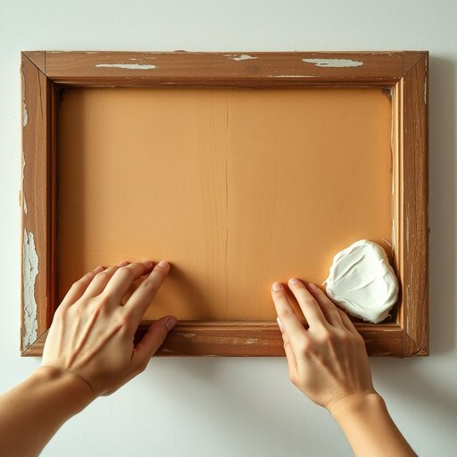

# putty

<h1 style="font-size: 2.5em; font-weight: 300; letter-spacing: 2px; margin: 0; color: #2c3e50;">
/ˈpəti/
</h1>

---

---

## 例句

Before repainting the old wooden window frames, which have started to crack and let in drafts during the chilly evenings, you’ll need to carefully remove the peeling paint and then apply a generous layer of putty, ensuring all gaps and imperfections are thoroughly filled to create a smooth, weatherproof surface.

*Before(/ˌbiˈfɔr/) repainting(/riˈpeɪntɪŋ/) the(/ðə/) old(/oʊld/) wooden(/ˈwʊdən/) window(/ˈwɪndoʊ/) frames,(/freɪmz,/) which(/wɪʧ/) have(/hæv/) started(/ˈstɑrtɪd/) to(/tɪ/) crack(/kræk/) and(/ənd/) let(/lɛt/) in(/ɪn/) drafts(/dræfts/) during(/ˈdʊrɪŋ/) the(/ðə/) chilly(/ˈʧɪli/) evenings,(/ˈivnɪŋz,/) you’ll(/you’ll*/) need(/nid/) to(/tɪ/) carefully(/ˈkɛrfəli/) remove(/riˈmuv/) the(/ðə/) peeling(/ˈpilɪŋ/) paint(/peɪnt/) and(/ənd/) then(/ðɛn/) apply(/əˈplaɪ/) a(/ə/) generous(/ˈʤɛnərəs/) layer(/leɪər/) of(/əv/) putty,(/ˈpəti,/) ensuring(/ɪnˈʃʊrɪŋ/) all(/ɔl/) gaps(/gæps/) and(/ənd/) imperfections(/ˌɪmpərˈfɛkʃənz/) are(/ər/) thoroughly(/ˈθəroʊli/) filled(/fɪld/) to(/tɪ/) create(/kriˈeɪt/) a(/ə/) smooth,(/smuð,/) weatherproof(/ˈwɛðərˌpruf/) surface.(/ˈsərfəs./)*

**翻译：** 在重新粉刷那些已开始开裂、在寒冷夜晚透风的旧木窗框之前，须先仔细清除剥落的油漆，然后涂抹一层厚实的腻子，确保所有缝隙和瑕疵都被彻底填平，以创造一个平滑且防风雨的表面。

---

## 解释

英语单词“putty”作为名词在家居生活用品场景中主要指一种用于建筑或维修工作的填缝剂，通常是软膏状的材料，用来密封窗户玻璃与框架之间的缝隙，防止风雨渗透或固定玻璃。具体使用场合常见于窗户安装、家具修复或墙面裂缝的填补，语境多涉及家庭装修、DIY项目或维修工具相关话题。英语学习者在使用“putty”时需注意其作为不可数名词时多指该材料整体，如“some putty”，而在特定语境中也可作可数名词表示一种特定类型的填缝剂。此外，与“apply putty”（涂抹腻子）、“window putty”（窗用腻子）等短语搭配较为常见。词源上，“putty”源自中古英语，可能来源于法语“poultice”（敷料）或拉丁语“pultes”（粥状物），反映其软糊状质地。中文语境中，“putty”通常准确翻译为“腻子”或“油灰”，强调其作为填补和密封材料的功能，使用时应根据实际材料和用途选择合适词汇。该词本身无褒贬色彩，属于中性实用性词汇，但在某些口语中也可能用于比喻表示可塑性强或容易操控的人或物，需要结合上下文理解。

---

<small style="color: #999; font-size: 0.9em;">2025-07-17 06:22:40</small>

