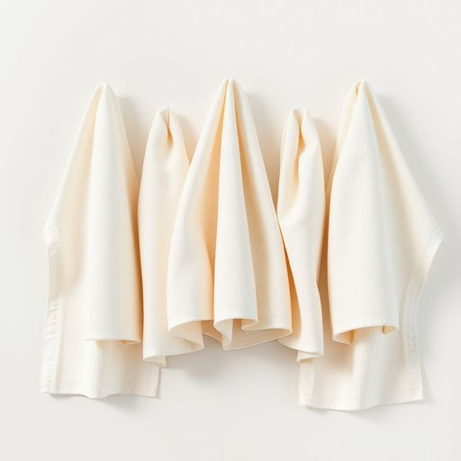

# quality

<h1 style="font-size: 2.5em; font-weight: 300; letter-spacing: 2px; margin: 0; color: #2c3e50;">
/kˈwɑləti/
</h1>

---

---

## 例句

I'm willing to pay a bit more for this brand of kitchen towels because, after reading several reviews and examining the fabric closely, I've concluded that the quality—both in terms of absorbency and durability—is far superior to cheaper alternatives, which tend to wear out quickly or leave lint behind.

*I'm(/əm/) willing(/ˈwɪlɪŋ/) to(/tɪ/) pay(/peɪ/) a(/ə/) bit(/bɪt/) more(/mɔr/) for(/fər/) this(/ðɪs/) brand(/brænd/) of(/əv/) kitchen(/ˈkɪʧən/) towels(/taʊəlz/) because,(/bɪˈkəz,/) after(/ˈæftər/) reading(/ˈrɛdɪŋ/) several(/ˈsɛvərəl/) reviews(/rəvˈjuz/) and(/ənd/) examining(/ɪgˈzæmɪnɪŋ/) the(/ðə/) fabric(/ˈfæbrɪk/) closely,(/ˈkloʊsli,/) I've(/aɪv/) concluded(/kənˈkludɪd/) that(/ðət/) the(/ðə/) quality—both(/quality—both*/) in(/ɪn/) terms(/tərmz/) of(/əv/) absorbency(/əbˈzɔrbənsi/) and(/ənd/) durability—is(/durability—is*/) far(/fɑr/) superior(/suˈpɪriər/) to(/tɪ/) cheaper(/ˈʧipər/) alternatives,(/ɔlˈtərnətɪvz,/) which(/wɪʧ/) tend(/tɛnd/) to(/tɪ/) wear(/wɛr/) out(/aʊt/) quickly(/kˈwɪkli/) or(/ər/) leave(/liv/) lint(/lɪnt/) behind.(/bɪˈhaɪnd./)*

**翻译：** 我愿意为这个品牌的厨房纸巾多花一些钱，因为阅读了许多评价并仔细观察其材质后，我确信其质量——无论是吸水性还是耐用性——都远胜于那些容易快速磨损或留下绒毛的廉价替代品。

---

## 解释

在家居生活用品的语境中，名词“quality”主要指产品的品质或质量，强调物品的优劣程度或性能好坏，通常用于描述家具、家电、厨具等的耐用性、材料档次、做工精细程度等具体属性。例如，当顾客评价一款沙发的quality时，往往关注其用料扎实、缝合工艺细致与否。在英语学习者使用该词时需注意，“quality”作为名词通常是不可数名词，表达“质量”的意思时不加复数，但当指“性质”、“特征”时可用复数“qualities”；此外，常见搭配包括“high quality”（高质量）、“poor quality”（低质量）、以及“of good quality”（品质优良的），这些词组广泛应用于商品描述和评价中；要避免误用如“qualities”来表示产品质地时需根据语境区分。词源方面，“quality”源自拉丁语“qualitas”，意为“性质、特征”，经过中古法语传入英语，最初泛指事物的性质，后来特别引申为品质和等级的含义。在中文中，“quality”准确对应“质量”或“品质”，但“质量”更多指产品的性能标准或优劣，而“品质”则更侧重于内在价值和用料工艺，两者在日常使用中常重合；需要注意的是，“quality”本身是中性词，但在评价时通过搭配不同词汇表达褒贬色彩，例如“high quality”带有赞赏意味，而“poor quality”则暗含贬义。综上，在家居生活用品场景中，“quality”作为名词核心体现的是物品的好坏标准和用户体验，是购买决策的重要参考因素。

---

<small style="color: #999; font-size: 0.9em;">2025-07-17 06:22:40</small>

