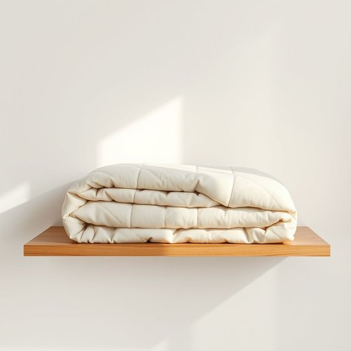

# quilt

<h1 style="font-size: 2.5em; font-weight: 300; letter-spacing: 2px; margin: 0; color: #2c3e50;">
/kwɪlt/
</h1>

---

---

## 例句

After spotting the quilt on the thrift store shelf, I asked the owner if it had a story, because quilts often carry memories stitched into their fabric, making them more than just blankets but cherished heirlooms passed down through generations.

*After(/ˈæftər/) spotting(/ˈspɑtɪŋ/) the(/ðə/) quilt(/kwɪlt/) on(/ɔn/) the(/ðə/) thrift(/θrɪft/) store(/stɔr/) shelf,(/ʃɛlf,/) I(/aɪ/) asked(/æst/) the(/ðə/) owner(/ˈoʊnər/) if(/ɪf/) it(/ɪt/) had(/hæd/) a(/ə/) story,(/ˈstɔri,/) because(/bɪˈkəz/) quilts(/kwɪlts/) often(/ˈɔfən/) carry(/ˈkɛri/) memories(/ˈmɛməriz/) stitched(/stɪʧt/) into(/ˈɪntu/) their(/ðɛr/) fabric,(/ˈfæbrɪk,/) making(/ˈmeɪkɪŋ/) them(/ðɛm/) more(/mɔr/) than(/ðən/) just(/ʤɪst/) blankets(/ˈblæŋkəts/) but(/bət/) cherished(/ˈʧɛrɪʃt/) heirlooms(/ˈɛˌrlumz/) passed(/pæst/) down(/daʊn/) through(/θru/) generations.(/ˌʤɛnərˈeɪʃənz./)*

**翻译：** 在旧货店的货架上看到这床拼布被后，我便问店主这被子是否有故事，因为拼布被往往蕴藏着缝在布料里的记忆，使它们不仅仅是普通的毯子，而是代代相传的珍贵传家宝。

---

## 解释

英语单词"quilt"作为名词在家居生活用品的语境中指的是一种用多层布料缝制而成的被子，通常包括外层的织物和内部的填充物（如棉花、羊毛或合成纤维），通过缝线将各层固定，既具保暖功能又有装饰效果。它常用于卧室作为盖被，也可用于沙发上作为毯子，其使用场合多为寒冷季节或需要增加舒适感的环境。在英语学习者使用该词时，需注意其不可数与可数用法：一般指单件被子时可数（a quilt），泛指此类物品时可作不可数名词；常见搭配有"patchwork quilt"（拼布被）、"make a quilt"（制作被子）、"quilt cover"或"quilt case"（被套）；另外，quilt在动词时指缝制被子，应区分词性。该词源自中古英语“quilte”，来自拉丁语“culcita”，意指填充物或软垫，体现了其以填充物结构为特色的本质。中文语境中，"quilt"应准确翻译为“被子”或“绗缝被”，强调其采用多层织物缝制和填充结构区别于普通毯子或床单，常用于描述冬季保暖或手工针织品。该词通常无褒贬色彩，文化上具有温馨、手工艺和传统家庭生活的美好联想，尤其在北美和欧洲文化中，拼布被作为家庭传承和个性表达的重要元素，富含情感和审美价值。

---

<small style="color: #999; font-size: 0.9em;">2025-07-17 06:22:40</small>

