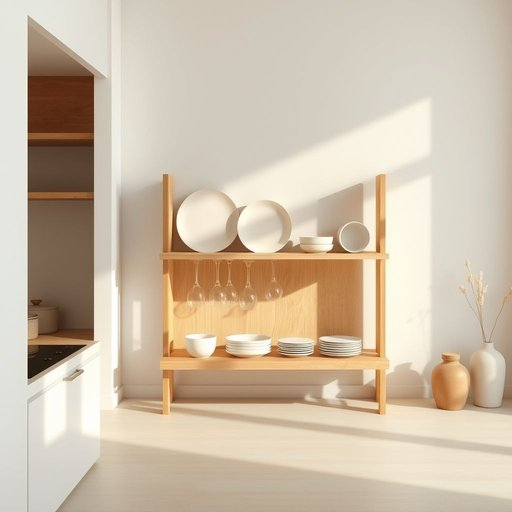

# rack

<h1 style="font-size: 2.5em; font-weight: 300; letter-spacing: 2px; margin: 0; color: #2c3e50;">
/ræk/
</h1>

---

---

## 例句

Could you please move the rack from the kitchen corner, where we usually hang the pots and pans, to the dining room, so that it’s easier to access the wine glasses and cutlery during dinner parties?

*Could(/kʊd/) you(/ju/) please(/pliz/) move(/muv/) the(/ðə/) rack(/ræk/) from(/frəm/) the(/ðə/) kitchen(/ˈkɪʧən/) corner,(/ˈkɔrnər,/) where(/wɛr/) we(/wi/) usually(/ˈjuʒəwəli/) hang(/hæŋ/) the(/ðə/) pots(/pɑts/) and(/ənd/) pans,(/pænz,/) to(/tɪ/) the(/ðə/) dining(/ˈdaɪnɪŋ/) room,(/rum,/) so(/soʊ/) that(/ðət/) it’s(/it’s*/) easier(/ˈiziər/) to(/tɪ/) access(/ˈækˌsɛs/) the(/ðə/) wine(/waɪn/) glasses(/ˈglæsɪz/) and(/ənd/) cutlery(/ˈkətləri/) during(/ˈdʊrɪŋ/) dinner(/ˈdɪnər/) parties?(/ˈpɑrtiz?/)*

**翻译：** 您能否将我们平时挂锅碗瓢盆的厨房角落的置物架移到餐厅，这样在举办晚宴时取用酒杯和餐具会更方便些？

---

## 解释

英语单词“rack”在家居生活用品的场景中作为名词，通常指用来放置、存储或晾晒物品的架子或撑架，如书架、鞋架、毛巾架、厨房用具架等，具体使用时多见于描述家中或办公环境中的收纳工具。英语学习者需要注意的是，“rack”作为可数名词，可以单独使用，也常与具体名词搭配，如“shoe rack”（鞋架）、“dish rack”（碗碟架）、“coat rack”（衣帽架），此外，复数形式为“racks”，表示多个架子或托架；语法上“on the rack”、“put something on a rack”等短语较为常用，表示“放在架子上”。“rack”一词源自中古英语，最初指折磨犯人的木架，后来词义扩展到表示任何支撑或放置物品的结构，这一历史背景在现代家居语境下不构成负面含义。中文中“rack”常被译为“架子”、“搁架”或“托架”，强调其实用功能，即用于摆放或收纳的工具，不含褒贬色彩，也没有特殊文化内涵，属于中性词汇。在实际应用时，应根据具体物品选用合适的搭配表达，以确保表达准确且符合习惯用法。

---

<small style="color: #999; font-size: 0.9em;">2025-07-17 06:22:40</small>

