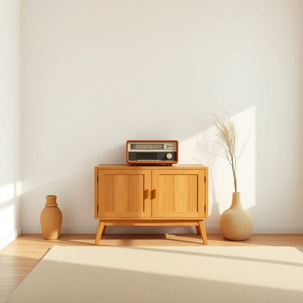

# radio

<h1 style="font-size: 2.5em; font-weight: 300; letter-spacing: 2px; margin: 0; color: #2c3e50;">
/ˈreɪdiˌoʊ/
</h1>

---

---

## 例句

While I was tidying up the living room, I noticed that the radio, which usually sits quietly on the wooden sideboard and fills the space with classical music during the afternoons, had suddenly stopped working, prompting me to check the batteries and the power cord before deciding whether to call an electrician or just replace it altogether.

*While(/waɪl/) I(/aɪ/) was(/wɑz/) tidying(/tidying*/) up(/əp/) the(/ðə/) living(/ˈlɪvɪŋ/) room,(/rum,/) I(/aɪ/) noticed(/ˈnoʊtɪst/) that(/ðət/) the(/ðə/) radio,(/ˈreɪdiˌoʊ,/) which(/wɪʧ/) usually(/ˈjuʒəwəli/) sits(/sɪts/) quietly(/kˈwaɪətli/) on(/ɔn/) the(/ðə/) wooden(/ˈwʊdən/) sideboard(/sideboard*/) and(/ənd/) fills(/fɪlz/) the(/ðə/) space(/speɪs/) with(/wɪθ/) classical(/ˈklæsɪkəl/) music(/mˈjuzɪk/) during(/ˈdʊrɪŋ/) the(/ðə/) afternoons,(/ˌæftərˈnunz,/) had(/hæd/) suddenly(/ˈsədənli/) stopped(/stɑpt/) working,(/ˈwərkɪŋ,/) prompting(/ˈprɑmptɪŋ/) me(/mi/) to(/tɪ/) check(/ʧɛk/) the(/ðə/) batteries(/ˈbætəriz/) and(/ənd/) the(/ðə/) power(/paʊər/) cord(/kɔrd/) before(/ˌbiˈfɔr/) deciding(/ˌdɪˈsaɪdɪŋ/) whether(/ˈwɛðər/) to(/tɪ/) call(/kɔl/) an(/ən/) electrician(/ɪlɛkˈtrɪʃən/) or(/ər/) just(/ʤɪst/) replace(/ˌriˈpleɪs/) it(/ɪt/) altogether.(/ˌɔltəˈgɛðər./)*

**翻译：** 当我整理客厅时，注意到那台平时安静地放在木质餐边柜上，午后常用来播放古典音乐的收音机突然停止了工作，这促使我检查了电池和电源线，随后才决定是该找电工修理，还是干脆直接更换一台。

---

## 解释

英语单词"radio"作为名词在家居生活用品场景中，主要指用于接收无线电波信号以播放声音（如音乐、新闻、广播节目等）的一种电子设备，常见于客厅、卧室或厨房等家庭环境中，具体使用场合包括听音乐、收听新闻广播、天气预报或其他电台节目，通常放置在书桌、柜台或床头，便于随时收听。英语学习者使用"radio"时需注意其可数性，作为具体设备时一般用作可数名词，例如"a radio"表示一台收音机，复数为"radios"，而当指广播这一媒介时用作不可数名词，如"listen to radio"（听广播）。常见搭配有"turn on/off the radio"（打开/关闭收音机）、"radio station"（电台）、"radio program"（广播节目）等。此外，"radio"在表达技术时也可指无线电通信，但在家居用品语境下多指收音设备。词源方面，"radio"来自拉丁语"radius"意为“光线、射线”，后引申为无线电波，19世纪末无线电技术发明后广泛采用此词。中文语境中，"radio"准确翻译为“收音机”，强调的是接收广播的设备，而非广播本身。该词在日常生活中无特殊褒贬含义，也不带有明显文化色彩，属于中性词汇，因其普及度高，学习时重点在区分物理设备和广播媒介的用法，避免误用。

---

<small style="color: #999; font-size: 0.9em;">2025-07-17 06:22:40</small>

