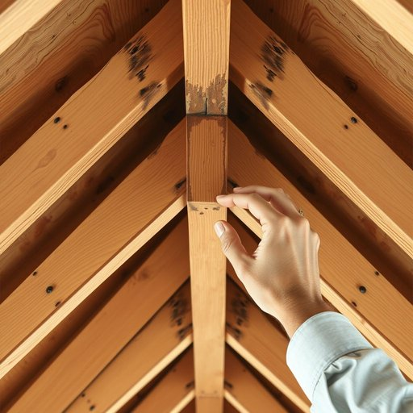

# rafter

<h1 style="font-size: 2.5em; font-weight: 300; letter-spacing: 2px; margin: 0; color: #2c3e50;">
/ˈræftər/
</h1>

---

---

## 例句

When the architect examined the rafter, which was crucial for supporting the roof structure, he noted that its integrity had been compromised by moisture infiltration, necessitating a comprehensive repair strategy to ensure the building's safety and durability.

*When(/wɪn/) the(/ðə/) architect(/ˈɑrkəˌtɛkt/) examined(/ɪgˈzæmənd/) the(/ðə/) rafter,(/ˈræftər,/) which(/wɪʧ/) was(/wɑz/) crucial(/ˈkruʃəl/) for(/fər/) supporting(/səˈpɔrtɪŋ/) the(/ðə/) roof(/rʊf/) structure,(/ˈstrəkʧər,/) he(/hi/) noted(/ˈnoʊtɪd/) that(/ðət/) its(/ɪts/) integrity(/ˌɪnˈtɛgrəti/) had(/hæd/) been(/bɪn/) compromised(/ˈkɑmprəˌmaɪzd/) by(/baɪ/) moisture(/ˈmɔɪsʧər/) infiltration,(/ˌɪnfɪlˈtreɪʃən,/) necessitating(/nəˈsɛsɪˌteɪtɪŋ/) a(/ə/) comprehensive(/ˌkɑmpriˈhɛnsɪv/) repair(/rɪˈpɛr/) strategy(/ˈstrætəʤi/) to(/tɪ/) ensure(/ɪnˈʃʊr/) the(/ðə/) building's(/ˈbɪldɪŋz/) safety(/ˈseɪfti/) and(/ənd/) durability.(/dərəˈbɪlɪti./)*

**翻译：** 当建筑师检查那根对支撑屋顶结构至关重要的椽子时，他发现其结构完整性已因水分渗透而受损，因而必须制定全面的修复方案，以确保建筑的安全性和耐久性。

---

## 解释

英语单词"rafter"在家居生活用品领域作为名词，指的是建筑结构中用于支撑屋顶的斜梁，通常是成对或多根平行排列，连接屋顶檩条和檩条以形成屋顶框架。在具体使用场合上，"rafter"常出现在房屋建筑、装修或结构设计的语境中，例如描述屋顶结构或讨论房屋加固时会用到这一词汇。学习者在使用“rafter”时需注意，它通常用作可数名词，复数形式为"rafters"，且常与动词“install”（安装）、“support”（支撑）、“inspect”（检查）等搭配，常见表达如“wooden rafters”（木质椽子）、“ceiling joists and rafters”（天花板托梁与椽子）等；此外，“rafter”也可出现在固定搭配“under the rafters”，意指“在屋檐下、在室内”，带有一定的空间方位含义。词源方面，“rafter”源自古英语“ræfter”，与荷兰语“rafter”和德语“Rafter”同源，原指木梁或支撑结构，其起源反映了古代建筑木构件的称呼传承。中文语境中，"rafter"准确翻译为“椽子”或“檩条”，是建筑屋顶结构中的基本组成部分，理解时应区分于“梁”（beam）和“檩”（purlin），具体指向斜向承重构件。该词无褒贬色彩或特殊文化内涵，属于技术性较强的专业术语，通常用于建筑、家装等领域，普通生活中较少单独提及，学习时重点掌握其建筑构件含义和正确使用搭配即可。

---

<small style="color: #999; font-size: 0.9em;">2025-07-17 06:22:40</small>

