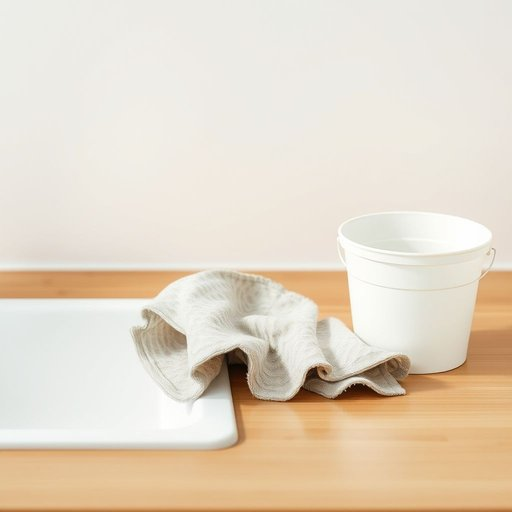

# rag

<h1 style="font-size: 2.5em; font-weight: 300; letter-spacing: 2px; margin: 0; color: #2c3e50;">
/ræg/
</h1>

---

---

## 例句

Could you please hand me the rag that’s been soaking in the bucket by the sink, the one with the faded floral pattern and slightly frayed edges, so I can wipe down the kitchen counter before we start preparing dinner?

*Could(/kʊd/) you(/ju/) please(/pliz/) hand(/hænd/) me(/mi/) the(/ðə/) rag(/ræg/) that’s(/that’s*/) been(/bɪn/) soaking(/ˈsoʊkɪŋ/) in(/ɪn/) the(/ðə/) bucket(/ˈbəkɪt/) by(/baɪ/) the(/ðə/) sink,(/sɪŋk,/) the(/ðə/) one(/wən/) with(/wɪθ/) the(/ðə/) faded(/ˈfeɪdɪd/) floral(/ˈflɔrəl/) pattern(/ˈpætərn/) and(/ənd/) slightly(/sˈlaɪtli/) frayed(/freɪd/) edges,(/ˈɛʤɪz,/) so(/soʊ/) I(/aɪ/) can(/kən/) wipe(/waɪp/) down(/daʊn/) the(/ðə/) kitchen(/ˈkɪʧən/) counter(/ˈkaʊntər/) before(/ˌbiˈfɔr/) we(/wi/) start(/stɑrt/) preparing(/pərˈpɛrɪŋ/) dinner?(/ˈdɪnər?/)*

**翻译：** 你能把水槽旁桶里浸着的那块抹布递给我吗？就是那块花纹已经褪色、边缘略显磨损的抹布，我想用它擦一擦厨房台面，然后我们再开始准备晚饭。

---

## 解释

英语单词“rag”作为名词在家居生活用品的语境中，通常指的是用旧的布片，常用来擦拭家具、清洁表面、抹去灰尘或溅出的液体，属于一种廉价且实用的清洁工具，常见于家庭、清洁工或维修场合中。英语学习者在使用“rag”时需注意，其为可数名词，可以用复数形式“rags”，且常与动词“wipe”，“clean”，“dust”搭配，如“use a rag to clean the table”（用抹布擦桌子）。此外，表达如“old rags”强调其旧且破损的状态，语境中带有“破旧”的含义。该词来源于古英语“ragg”或中世纪拉丁语“ragga”，意指破布或破布片，反映了其最初用作破旧布料的属性。在中文语境中，“rag”通常翻译为“抹布”、“破布”或“破旧布块”，强调的是实用的清洁材料，而非精致布料。需要注意的是，“rag”本身没有明显褒义或贬义，但在某些表达中如“ragged clothes”可能带有贫穷、破烂的贬义色彩，故在家居清洁语境外使用时需结合具体语境理解。此外，“rag”有时在口语或俚语中也指“戏谑”或“责备”，但这与家居生活用品的含义无关，学习时应区分使用场合，避免混淆。

---

<small style="color: #999; font-size: 0.9em;">2025-07-17 06:22:40</small>

