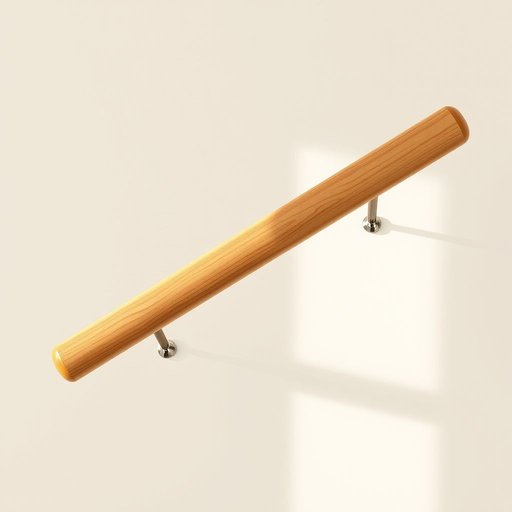

# railing

<h1 style="font-size: 2.5em; font-weight: 300; letter-spacing: 2px; margin: 0; color: #2c3e50;">
/ˈreɪlɪŋ/
</h1>

---

---

## 例句

Before you start painting, make sure the railing on the staircase is firmly secured and free from any peeling varnish or rust, because a loose or damaged railing could pose a serious safety risk, especially if you have young children or elderly visitors at home.

*Before(/ˌbiˈfɔr/) you(/ju/) start(/stɑrt/) painting,(/ˈpeɪnɪŋ,/) make(/meɪk/) sure(/ʃʊr/) the(/ðə/) railing(/ˈreɪlɪŋ/) on(/ɔn/) the(/ðə/) staircase(/ˈstɛrˌkeɪs/) is(/ɪz/) firmly(/ˈfərmli/) secured(/sɪˈkjʊrd/) and(/ənd/) free(/fri/) from(/frəm/) any(/ˈɛni/) peeling(/ˈpilɪŋ/) varnish(/ˈvɑrnɪʃ/) or(/ər/) rust,(/rəst,/) because(/bɪˈkəz/) a(/ə/) loose(/lus/) or(/ər/) damaged(/ˈdæmɪʤd/) railing(/ˈreɪlɪŋ/) could(/kʊd/) pose(/poʊz/) a(/ə/) serious(/ˈsɪriəs/) safety(/ˈseɪfti/) risk,(/rɪsk,/) especially(/əˈspɛʃəli/) if(/ɪf/) you(/ju/) have(/hæv/) young(/jəŋ/) children(/ˈʧɪldrən/) or(/ər/) elderly(/ˈɛldərli/) visitors(/ˈvɪzɪtərz/) at(/æt/) home.(/hoʊm./)*

**翻译：** 在开始刷漆之前，请确保楼梯的扶手已牢固固定，且表面没有脱落的清漆或锈斑，因为松动或受损的扶手可能带来严重的安全隐患，尤其是在家中有年幼儿童或年长访客的情况下。

---

## 解释

英语单词“railing”作为名词在家居生活用品语境中，通常指的是用来围栏、扶手或支撑的栏杆，如楼梯扶手、阳台栏杆或阳台护栏等，具体使用场合多见于描述建筑构造或家居设计中的安全设施或装饰元素。英语学习者在使用“railing”时需注意其复数形式为“railings”，且该词不可数用法较少见，常与形容词如“wooden railing”（木质栏杆）、“metal railing”（金属栏杆）或动词短语如“hold onto the railing”（抓住栏杆）搭配。需要区分该词与“rail”（铁轨、栏杆）在具体语境中的不同含义。词源上，“railing”源自中世纪英语“rail”加上名词后缀“ing”，原意为横杆、围栏，是由古英语“regil”演变而来，反映了其作为横杆支撑或界限的功能。在中文语境中，“railing”准确翻译为“栏杆”或“扶手”，强调其保护或支持作用，没有明显褒贬含义，属于中性名词，常见于家装、建筑设计及安全提示中，文化内涵偏向实用和安全保障，学习和使用时应结合具体环境灵活选择合适的译法以体现其结构和功能特点。

---

<small style="color: #999; font-size: 0.9em;">2025-07-17 06:22:40</small>

