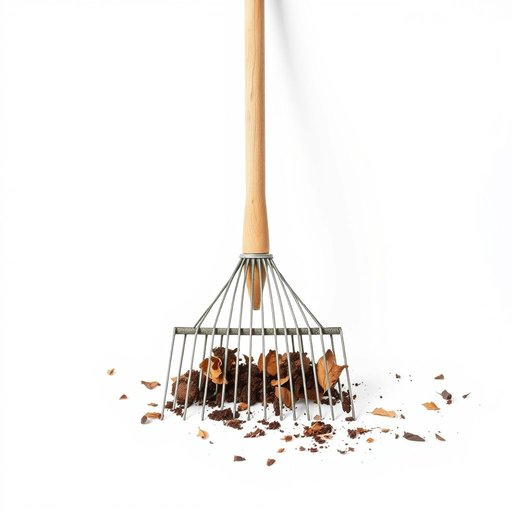

# rake

<h1 style="font-size: 2.5em; font-weight: 300; letter-spacing: 2px; margin: 0; color: #2c3e50;">
/reɪk/
</h1>

---

---

## 例句

After spending the entire afternoon tidying up the garden, I realized that the rake, which I had carelessly left leaning against the shed, was covered in stubborn mud and leaves, making it necessary to clean it thoroughly before storing it away for the winter.

*After(/ˈæftər/) spending(/ˈspɛndɪŋ/) the(/ðə/) entire(/ɪnˈtaɪər/) afternoon(/ˌæftərˈnun/) tidying(/tidying*/) up(/əp/) the(/ðə/) garden,(/ˈgɑrdən,/) I(/aɪ/) realized(/ˈriəˌlaɪzd/) that(/ðət/) the(/ðə/) rake,(/reɪk,/) which(/wɪʧ/) I(/aɪ/) had(/hæd/) carelessly(/ˈkɛrlɛsli/) left(/lɛft/) leaning(/ˈlinɪŋ/) against(/əˈgɛnst/) the(/ðə/) shed,(/ʃɛd,/) was(/wɑz/) covered(/ˈkəvərd/) in(/ɪn/) stubborn(/ˈstəbərn/) mud(/məd/) and(/ənd/) leaves,(/livz,/) making(/ˈmeɪkɪŋ/) it(/ɪt/) necessary(/ˈnɛsəˌsɛri/) to(/tɪ/) clean(/klin/) it(/ɪt/) thoroughly(/ˈθəroʊli/) before(/ˌbiˈfɔr/) storing(/ˈstɔrɪŋ/) it(/ɪt/) away(/əˈweɪ/) for(/fər/) the(/ðə/) winter.(/ˈwɪntər./)*

**翻译：** 花了整个下午整理花园后，我才发现那个我早先不经意地靠在工具棚上的耙子满是顽固的泥土和树叶，必须彻底清洗干净，才能妥善收存过冬。

---

## 解释

英语单词“rake”在家居生活用品场景中作为名词，通常指一种用于园艺或清理庭院的耙子，这种工具一般具有长柄和排列成排的齿，用来集聚树叶、草屑或松土。具体使用场合多见于家庭花园、庭院整理或农作物收获时，尤其是在秋季落叶清理或土地耕作辅助中非常常见。英语学习者在使用该词时需注意，“rake”作为名词时通常指实物工具，且多数情况下为可数名词，常见搭配包括“garden rake”（园艺耙）、“leaf rake”（落叶耙）等，且习惯上其复数形式为“rakes”。语法上，避免将其与动词形式混淆，动词“to rake”意为“使用耙子耙地”或“搜集”，不同语法结构下含义和用法不同。此外，“rake”一词源于中古英语“raken”，源自古英语“racian”，意为“抓取、耙起”，其根源与古诺斯语及其他日耳曼语言的类似词汇相关，反映了工具实用的历史背景。在中文语境中，“rake”准确翻译为“耙子”，体现其作为园艺工具的功能，通常不带特殊褒贬色彩或文化隐含，仅在特定方言或口语中可能引申为“放荡不羁的人”等俚语含义，但在家居生活用具场景中并无此类色彩，因此理解时应结合具体语境，确保表达工具意义。

---

<small style="color: #999; font-size: 0.9em;">2025-07-17 06:22:40</small>

