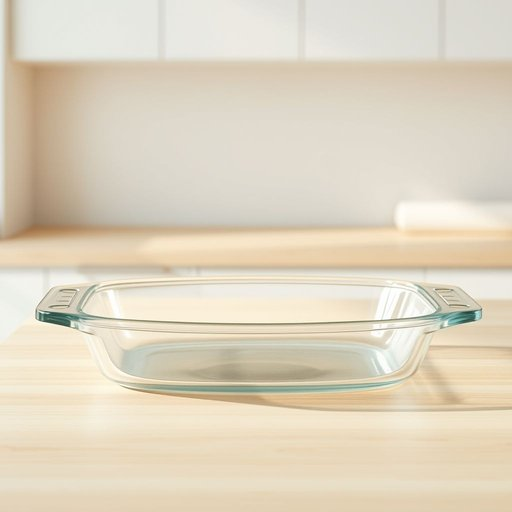

# ramekin

<h1 style="font-size: 2.5em; font-weight: 300; letter-spacing: 2px; margin: 0; color: #2c3e50;">
/ramekin*/
</h1>

---

---

## 例句

After carefully washing the delicate glass ramekin, which I had used the night before to bake a rich chocolate soufflé, I stacked it neatly alongside the other assorted kitchenware, knowing it would be just perfect for serving individual portions of crème brûlée at our upcoming dinner party.

*After(/ˈæftər/) carefully(/ˈkɛrfəli/) washing(/ˈwɑʃɪŋ/) the(/ðə/) delicate(/ˈdɛləkət/) glass(/glæs/) ramekin,(/ramekin*,/) which(/wɪʧ/) I(/aɪ/) had(/hæd/) used(/juzd/) the(/ðə/) night(/naɪt/) before(/ˌbiˈfɔr/) to(/tɪ/) bake(/beɪk/) a(/ə/) rich(/rɪʧ/) chocolate(/ˈʧɔklət/) soufflé,(/soufflé*é,/) I(/aɪ/) stacked(/stækt/) it(/ɪt/) neatly(/ˈnitli/) alongside(/əˈlɔŋˈsaɪd/) the(/ðə/) other(/ˈəðər/) assorted(/əˈsɔrtɪd/) kitchenware,(/ˈkɪʧənˌwɛr,/) knowing(/noʊɪŋ/) it(/ɪt/) would(/wʊd/) be(/bi/) just(/ʤɪst/) perfect(/ˈpərˌfɪkt/) for(/fər/) serving(/ˈsərvɪŋ/) individual(/ˌɪndəˈvɪʤəwəl/) portions(/ˈpɔrʃənz/) of(/əv/) crème(/crème*/) brûlée(/brûlée*/) at(/æt/) our(/ɑr/) upcoming(/ˈəpˌkəmɪŋ/) dinner(/ˈdɪnər/) party.(/ˈpɑrti./)*

**翻译：** 在仔细清洗了前一晚用来烤制浓郁巧克力舒芙蕾的那只精致玻璃烤碗后，我将它整齐地与其他各式厨具叠放在一起，心想它将非常适合在即将举办的晚宴上盛装单份焦糖布丁。

---

## 解释

“ramekin”作为名词，指的是一种小巧、耐热的陶瓷或玻璃容器，主要用于烘焙和盛放酱料、甜点、蛋奶冻等食物，常见于家居厨房用品中，适合制作单人份量的烤菜或甜品，使用场合多为烹饪、餐饮或餐桌摆盘。英语学习者在使用“ramekin”时需注意其单复数形式ramkins，以及常与烹饪相关动词搭配，如“bake in a ramekin”（在小烤碗中烘烤）、“serve in ramekins”（用烤碗盛装），此外常见固定搭配有“crème brûlée ramekin”（焦糖布丁烤碗）。词源上，“ramekin”源自法语“ramekin”，意为用于汤或肉羹的小碗，进一步源自荷兰语“rammekijn”，原意为烤盘或小碗，体现其欧洲饮食文化的历史背景。在中文语境中，“ramekin”准确翻译为“小烤碗”或“烤盅”，强调其耐热和适合烘烤的特性，无特别褒贬含义或文化色彩，属于厨房餐具的中性词汇，理解时应结合具体烹饪情境，体现其实用功能和材质特点。

---

<small style="color: #999; font-size: 0.9em;">2025-07-17 06:22:40</small>

