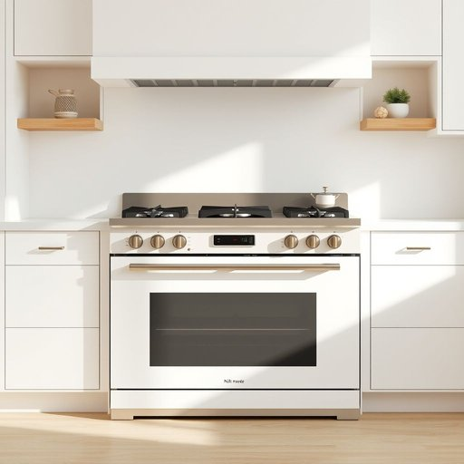

# range

<h1 style="font-size: 2.5em; font-weight: 300; letter-spacing: 2px; margin: 0; color: #2c3e50;">
/reɪnʤ/
</h1>

---

---

## 例句

The new cooker in the kitchen offers an impressive range of heat settings, allowing precise temperature adjustments whether you are simmering a delicate sauce or roasting a joint for hours to achieve perfect results every time.

*The(/ðə/) new(/nu/) cooker(/ˈkʊkər/) in(/ɪn/) the(/ðə/) kitchen(/ˈkɪʧən/) offers(/ˈɔfərz/) an(/ən/) impressive(/ˌɪmˈprɛsɪv/) range(/reɪnʤ/) of(/əv/) heat(/hit/) settings,(/ˈsɛtɪŋz,/) allowing(/əˈlaʊɪŋ/) precise(/prɪˈsaɪs/) temperature(/ˈtɛmpərəʧər/) adjustments(/əˈʤəstmənts/) whether(/ˈwɛðər/) you(/ju/) are(/ər/) simmering(/ˈsɪmərɪŋ/) a(/ə/) delicate(/ˈdɛləkət/) sauce(/sɔs/) or(/ər/) roasting(/ˈroʊstɪŋ/) a(/ə/) joint(/ʤɔɪnt/) for(/fər/) hours(/aʊərz/) to(/tɪ/) achieve(/əˈʧiv/) perfect(/ˈpərˌfɪkt/) results(/rɪˈzəlts/) every(/ˈɛvəri/) time.(/taɪm./)*

**翻译：** 厨房里的新炉灶具备多档火力调节，无论是细火慢炖精致酱料，还是长时间烤制肉块，都能精准控制温度，确保每次都能达到理想的烹饪效果。

---

## 解释

在家居生活用品的语境中，英语单词“range”作为名词通常指“炉灶”或“灶具”，特指带有烤箱和多个燃烧头的厨房设备，常见于家庭厨房里用来烹饪和烘焙。具体使用场合多为描述厨房电器，如“What kind of range do you have in your kitchen?”（你厨房里有什么样的炉灶？）或者“Gas range”（燃气灶）和“electric range”（电炉灶）等表达。英语学习者在使用该词时需注意其多义性，因“range”本身还有“范围、幅度、系列”等多重含义，且作为名词时常用的固定搭配有“kitchen range”或直接用“range”指代厨房炉灶。此外，语法上“range”作为可数名词，复数形式为“ranges”。词源上，“range”来源于中古英语，最初意味着“排列、排布”，源自古法语“rangier”，意指排列一系列物品，衍生出有序排列或范围的含义，而作为厨房炉灶的用法源于炉具排列组合形成的整体设备概念。在中文语境中，“range”翻译为“炉灶”时，应准确理解其为包含多功能的烹饪设备，而非简单的“范围”或“系列”，避免混淆。该词在家居用品领域中无明显褒贬色彩，但因其多义性，使用时需根据上下文判断具体含义，确保表达清晰。

---

<small style="color: #999; font-size: 0.9em;">2025-07-17 06:22:40</small>

