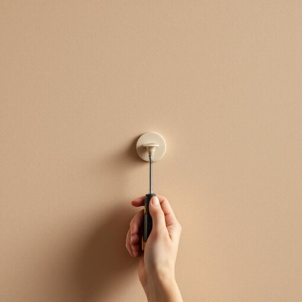

# rawlplug

<h1 style="font-size: 2.5em; font-weight: 300; letter-spacing: 2px; margin: 0; color: #2c3e50;">
/rawlplug*/
</h1>

---

---

## 例句

Before you start drilling into the wall to hang the new bookshelf, make sure you have the correct size of rawlplug, as using one that’s too small or too large could compromise the fixture’s stability and ultimately cause the shelf to fall, which would not only damage your belongings but also create unnecessary safety hazards in the living room.

*Before(/ˌbiˈfɔr/) you(/ju/) start(/stɑrt/) drilling(/ˈdrɪlɪŋ/) into(/ˈɪntu/) the(/ðə/) wall(/wɔl/) to(/tɪ/) hang(/hæŋ/) the(/ðə/) new(/nu/) bookshelf,(/ˈbʊkˌʃɛlf,/) make(/meɪk/) sure(/ʃʊr/) you(/ju/) have(/hæv/) the(/ðə/) correct(/kərˈɛkt/) size(/saɪz/) of(/əv/) rawlplug,(/rawlplug*,/) as(/ɛz/) using(/ˈjuzɪŋ/) one(/wən/) that’s(/that’s*/) too(/tu/) small(/smɔl/) or(/ər/) too(/tu/) large(/lɑrʤ/) could(/kʊd/) compromise(/ˈkɑmprəˌmaɪz/) the(/ðə/) fixture’s(/fixture’s*/) stability(/stəˈbɪlɪti/) and(/ənd/) ultimately(/ˈəltəmətli/) cause(/kɔz/) the(/ðə/) shelf(/ʃɛlf/) to(/tɪ/) fall,(/fɔl,/) which(/wɪʧ/) would(/wʊd/) not(/nɑt/) only(/ˈoʊnli/) damage(/ˈdæmɪʤ/) your(/jʊr/) belongings(/bɪˈlɔŋɪŋz/) but(/bət/) also(/ˈɔlsoʊ/) create(/kriˈeɪt/) unnecessary(/ənˈnɛsəˌsɛri/) safety(/ˈseɪfti/) hazards(/ˈhæzərdz/) in(/ɪn/) the(/ðə/) living(/ˈlɪvɪŋ/) room.(/rum./)*

**翻译：** 在开始钻墙安装新书架之前，请确保所用膨胀管的尺寸正确，因为使用过小或过大的膨胀管都会影响固定的牢固度，最终可能导致书架掉落，不仅会损坏您的物品，还会在客厅造成不必要的安全隐患。

---

## 解释

rawlplug作为名词，指的是一种用于固定螺丝钉于墙体尤其是石膏板、砖墙或混凝土等材质内的膨胀管或塑料塞，在家居生活用品中常见于安装挂钩、架子、锁具等需要牢固固定的场合。使用时通常先将rawlplug嵌入预先钻好的孔内，再拧入螺丝，使其膨胀并紧紧卡住墙体以增强稳固性。英语学习者需要注意，rawlplug通常是可数名词，复数形式为rawlplugs，常见的搭配包括insert a rawlplug into the wall（把膨胀管插入墙内）、screw into a rawlplug（将螺丝钉入膨胀管）等，且其用法较专业，多用于技术或日常DIY语境中，不常见于口语日常对话。此外，该词的形态和用法与plug本身有关，表示插入物的含义。rawlplug一词源自英国，Rawlplug公司于1910年发明了这种膨胀管装置，后来该品牌名泛指类似产品，体现了专有名词变通用名称的语言现象。中文中通常译为膨胀管或膨胀塞，强调其在墙体中膨胀固定螺丝的功能，理解时应避免直译为塞子而忽略其机械固定作用。此词没有特别的褒贬或文化色彩，属于实用技术词汇，掌握后有助于准确描述家居安装过程中的细节操作。

---

<small style="color: #999; font-size: 0.9em;">2025-07-17 06:22:40</small>

