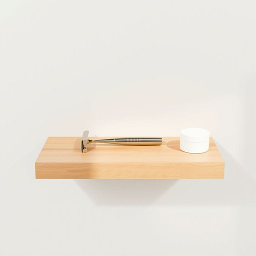

# razor

<h1 style="font-size: 2.5em; font-weight: 300; letter-spacing: 2px; margin: 0; color: #2c3e50;">
/ˈreɪzər/
</h1>

---

---

## 例句

Could you please check if the razor I left on the bathroom shelf—next to the aftershave and the shaving cream—is still there, or did someone accidentally pack it away with the toiletries when they tidied up yesterday?

*Could(/kʊd/) you(/ju/) please(/pliz/) check(/ʧɛk/) if(/ɪf/) the(/ðə/) razor(/ˈreɪzər/) I(/aɪ/) left(/lɛft/) on(/ɔn/) the(/ðə/) bathroom(/ˈbæθˌrum/) shelf—next(/shelf—next*/) to(/tɪ/) the(/ðə/) aftershave(/ˌæftərˈʃeɪv/) and(/ənd/) the(/ðə/) shaving(/ˈʃeɪvɪŋ/) cream—is(/cream—is*/) still(/stɪl/) there,(/ðɛr,/) or(/ər/) did(/dɪd/) someone(/ˈsəmˌwən/) accidentally(/ˌæksəˈdɛnəli/) pack(/pæk/) it(/ɪt/) away(/əˈweɪ/) with(/wɪθ/) the(/ðə/) toiletries(/ˈtɔɪlətriz/) when(/wɪn/) they(/ðeɪ/) tidied(/tidied*/) up(/əp/) yesterday?(/ˈjɛstərˌdeɪ?/)*

**翻译：** 请您帮忙查看一下，我放在浴室架子上的剃须刀就在须后水和剃须膏旁边，是否还在，还是昨天整理时有人不小心把它和洗漱用品一同收拾走了？

---

## 解释

razor作为名词在家居生活用品的语境中，主要指的是用于刮除体毛尤其是胡须的剃刀，常见于浴室或个人护理场合如刮胡子、修剪腋毛或腿毛等。使用时多出现在描述个人卫生、剃须用品或美容工具的话题中，典型搭配包括electric razor电动剃须刀、safety razor安全剃刀、razor blade剃刀片等，英语学习者应注意razor一般为可数名词，复数形式为razors，常与定冠词或数量词连用如a razor、my razors，在表达时应区分razor指剃刀本身与razor blade指更换用的刀片。此外，razor在表达技巧上常用于比喻razor-sharp极其锋利或敏锐形容某物极具锋利度或思想敏锐性。关于词源，razor源自中古英语rasour，其根源可追溯到拉丁语radere意为刮擦，反映了其工具的基本功能。中文语境中，razor通常被准确翻译为剃刀或刮胡刀，根据具体使用场合可简化为剃须刀，强调其在日常生活中剃除毛发的功能，没有特别的褒贬色彩，但在某些文化中，剃须行为也可能涉及个人形象和习惯的社会意义，总体来看，razor作为日常用品词汇较为中性、实用，是个人卫生护理中不可或缺的工具。

---

<small style="color: #999; font-size: 0.9em;">2025-07-17 06:22:40</small>

