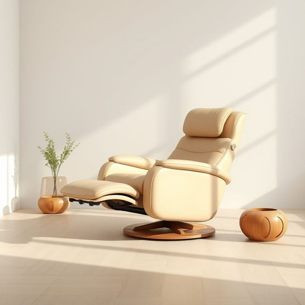

# recliner

<h1 style="font-size: 2.5em; font-weight: 300; letter-spacing: 2px; margin: 0; color: #2c3e50;">
/rɪˈklaɪnər/
</h1>

---

---

## 例句

After a long day at work, nothing beats sinking into the plush recliner we bought last winter, which, besides its luxurious leather upholstery, features an adjustable footrest and a reclining backrest that allows you to find the perfect position for reading, watching television, or simply relaxing.

*After(/ˈæftər/) a(/ə/) long(/lɔŋ/) day(/deɪ/) at(/æt/) work,(/wərk,/) nothing(/ˈnəθɪŋ/) beats(/bits/) sinking(/ˈsɪŋkɪŋ/) into(/ˈɪntu/) the(/ðə/) plush(/pləʃ/) recliner(/rɪˈklaɪnər/) we(/wi/) bought(/bɔt/) last(/læst/) winter,(/ˈwɪntər,/) which,(/wɪʧ,/) besides(/ˌbiˈsaɪdz/) its(/ɪts/) luxurious(/ləgˈʒəriəs/) leather(/ˈlɛðər/) upholstery,(/əˈpoʊlstəri,/) features(/ˈfiʧərz/) an(/ən/) adjustable(/əˈʤəstəbəl/) footrest(/footrest*/) and(/ənd/) a(/ə/) reclining(/rɪˈklaɪnɪŋ/) backrest(/ˈbæˌkrɛst/) that(/ðət/) allows(/əˈlaʊz/) you(/ju/) to(/tɪ/) find(/faɪnd/) the(/ðə/) perfect(/ˈpərˌfɪkt/) position(/pəˈzɪʃən/) for(/fər/) reading,(/ˈrɛdɪŋ,/) watching(/ˈwɑʧɪŋ/) television,(/ˈtɛləˌvɪʒən,/) or(/ər/) simply(/ˈsɪmpli/) relaxing.(/rɪˈlæksɪŋ./)*

**翻译：** 经过一天的辛劳工作，最惬意的莫过于沉浸在我们去年冬天购入的那把柔软豪华的躺椅中。除了奢华的皮革包覆外，它还配备可调节的脚踏板和可倾斜的靠背，让你轻松找到阅读、观看电视或单纯放松的完美姿势。

---

## 解释

“recliner”作为名词，主要指一种可以调节靠背和脚踏的位置，以便人体在坐姿时能够后仰放松的家具，常见于客厅、起居室或家庭影院等家居生活环境中。具体使用时，通常出现在描述舒适休息、放松或家庭娱乐的语境中，比如“a leather recliner”表示皮质的躺椅。英语学习者应注意此词作为名词时不可数，常与形容词连用形成复合词组，如“comfortable recliner”、“electric recliner”，且常用的动词搭配有“sit in a recliner”或“adjust the recliner”。此外，“recliner”源于拉丁语动词“reclinare”，意为“向后倾斜”，反映了该家具的功能属性。中文语境中，通常翻译为“躺椅”或“可后仰扶手椅”，强调其调节靠背以实现半躺或斜靠的特征。该词没有褒贬含义，文化内涵较为中性，主要体现现代家居对舒适性和功能性的追求。总的来说，“recliner”是一种专指具备后仰功能的休闲椅，适用于描述家庭生活中追求放松体验的家具用品。

---

<small style="color: #999; font-size: 0.9em;">2025-07-17 06:22:40</small>

