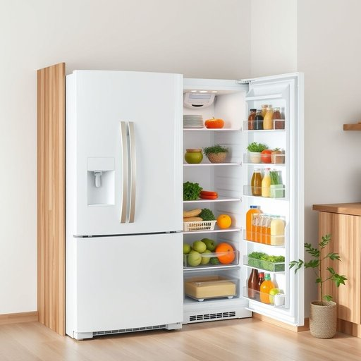

# refrigerator

<h1 style="font-size: 2.5em; font-weight: 300; letter-spacing: 2px; margin: 0; color: #2c3e50;">
/rɪˈfrɪʤərˌeɪtər/
</h1>

---

---

## 例句

Although the refrigerator, which we've had since last summer and is equipped with an energy-efficient compressor, hums quietly in the corner of the kitchen, I still find myself double-checking its contents every evening to make sure none of the fresh vegetables or leftovers have gone bad before preparing dinner.

*Although(/ˌɔlˈðoʊ/) the(/ðə/) refrigerator,(/rɪˈfrɪʤərˌeɪtər,/) which(/wɪʧ/) we've(/wiv/) had(/hæd/) since(/sɪns/) last(/læst/) summer(/ˈsəmər/) and(/ənd/) is(/ɪz/) equipped(/ɪkˈwɪpt/) with(/wɪθ/) an(/ən/) energy-efficient(/energy-efficient*/) compressor,(/kəmˈprɛsər,/) hums(/həmz/) quietly(/kˈwaɪətli/) in(/ɪn/) the(/ðə/) corner(/ˈkɔrnər/) of(/əv/) the(/ðə/) kitchen,(/ˈkɪʧən,/) I(/aɪ/) still(/stɪl/) find(/faɪnd/) myself(/ˌmaɪˈsɛlf/) double-checking(/double-checking*/) its(/ɪts/) contents(/ˈkɑntɛnts/) every(/ˈɛvəri/) evening(/ˈivnɪŋ/) to(/tɪ/) make(/meɪk/) sure(/ʃʊr/) none(/nən/) of(/əv/) the(/ðə/) fresh(/frɛʃ/) vegetables(/ˈvɛʤtəbəlz/) or(/ər/) leftovers(/ˈlɛfˌtoʊvərz/) have(/hæv/) gone(/gɔn/) bad(/bæd/) before(/ˌbiˈfɔr/) preparing(/pərˈpɛrɪŋ/) dinner.(/ˈdɪnər./)*

**翻译：** 尽管这台冰箱自去年夏天购买以来一直安静地嗡嗡作响，角落里那台配备了节能压缩机的冰箱依旧让我每天晚上在准备晚餐前反复确认冰箱里的新鲜蔬菜和剩饭是否变质。

---

## 解释

英语单词“refrigerator”作为名词，指的是家庭或商业场合中用于冷藏和保存食物、饮料等易腐物品的电器，通常出现在厨房或餐厅等生活空间。学习者使用时需注意它是可数名词，复数形式为“refrigerators”，且常与动词“keep”、“store”、“put in”、“defrost”等搭配，如“put vegetables in the refrigerator”（把蔬菜放进冰箱）或“the refrigerator is running”（冰箱在工作）。此外，日常口语中常用缩略语“fridge”代替“refrigerator”，但正式语境和书写中应优先使用完整形式。该词源自拉丁语“refrigerare”，意为“使变冷”，通过英文形成现代含义，反映其冷却功能。中文语境中准确翻译为“冰箱”或“电冰箱”，强调其在食品保存方面的应用，不含褒贬色彩，仅是描述生活必备家电的一般名词，文化内涵与其他工业化国家相似，无特殊隐喻或象征。

---

<small style="color: #999; font-size: 0.9em;">2025-07-17 06:22:40</small>

