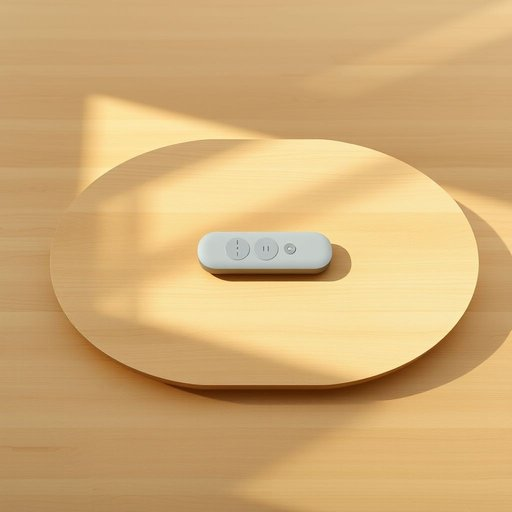

# remote

<h1 style="font-size: 2.5em; font-weight: 300; letter-spacing: 2px; margin: 0; color: #2c3e50;">
/rɪˈmoʊt/
</h1>

---

---

## 例句

Could you please hand me the remote, as its location on the coffee table ensures I can control the channels without interrupting the comfort of those already settled for the evening?

*Could(/kʊd/) you(/ju/) please(/pliz/) hand(/hænd/) me(/mi/) the(/ðə/) remote,(/rɪˈmoʊt,/) as(/ɛz/) its(/ɪts/) location(/loʊˈkeɪʃən/) on(/ɔn/) the(/ðə/) coffee(/ˈkɔfi/) table(/ˈteɪbəl/) ensures(/ɪnˈʃʊrz/) I(/aɪ/) can(/kən/) control(/kənˈtroʊl/) the(/ðə/) channels(/ˈʧænəlz/) without(/wɪˈθaʊt/) interrupting(/ˌɪntərˈəptɪŋ/) the(/ðə/) comfort(/ˈkəmfərt/) of(/əv/) those(/ðoʊz/) already(/ɔˈrɛdi/) settled(/ˈsɛtəld/) for(/fər/) the(/ðə/) evening?(/ˈivnɪŋ?/)*

**翻译：** 请您把遥控器递给我好吗？它放在茶几上，这样我就能在不打扰已经安顿好休息的大家的情况下，轻松换台。

---

## 解释

英语单词“remote”作为名词，在家居生活用品的语境中通常指的是“遥控器”，即用来远程操作电视、空调等电子设备的手持装置。具体使用场合多见于家庭对话或购物、产品说明中，例如“Please pass me the remote”（请把遥控器递给我）。学习者使用时需注意其词性转换，作为名词时一般用单数形式“a remote”或复数“remotes”，且常与动词“hold,”“use,”“lose”搭配，如“hold the remote”或“lose the remote”。此外，“remote”作为形容词时含义完全不同，表示“遥远的”或“偏僻的”，避免混淆是学习重点。该词源自拉丁语“remotus”，意为“被移开、远离”，引申为控制距离上的遥控物件。中文中对应的意思是“遥控器”，是对该设备的准确翻译，无特别褒贬色彩，属于常用家居生活词汇，反映现代生活中便捷控制家用电器的文化现象。

---

<small style="color: #999; font-size: 0.9em;">2025-07-17 06:22:40</small>

