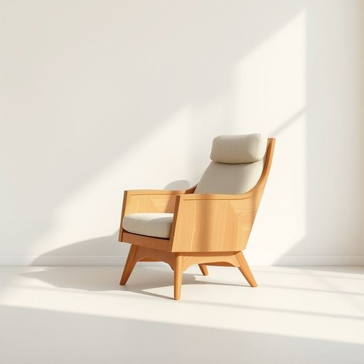

# rest

<h1 style="font-size: 2.5em; font-weight: 300; letter-spacing: 2px; margin: 0; color: #2c3e50;">
/rɛst/
</h1>

---

---

## 例句

After a long day of tidying up the living room and rearranging the shelves, I finally sank into the armchair with a soft cushion supporting my back and a sturdy footrest ensuring that every part of me could enjoy a well-deserved rest.

*After(/ˈæftər/) a(/ə/) long(/lɔŋ/) day(/deɪ/) of(/əv/) tidying(/tidying*/) up(/əp/) the(/ðə/) living(/ˈlɪvɪŋ/) room(/rum/) and(/ənd/) rearranging(/ˌriərˈeɪnʤɪŋ/) the(/ðə/) shelves,(/ʃɛlvz,/) I(/aɪ/) finally(/ˈfaɪnəli/) sank(/sæŋk/) into(/ˈɪntu/) the(/ðə/) armchair(/ˈɑrmˌʧɛr/) with(/wɪθ/) a(/ə/) soft(/sɔft/) cushion(/ˈkʊʃən/) supporting(/səˈpɔrtɪŋ/) my(/maɪ/) back(/bæk/) and(/ənd/) a(/ə/) sturdy(/ˈstərdi/) footrest(/footrest*/) ensuring(/ɪnˈʃʊrɪŋ/) that(/ðət/) every(/ˈɛvəri/) part(/pɑrt/) of(/əv/) me(/mi/) could(/kʊd/) enjoy(/ˌɛnˈʤɔɪ/) a(/ə/) well-deserved(/well-deserved*/) rest.(/rɛst./)*

**翻译：** 经过一整天整理客厅和重新摆放书架后，我终于坐进了那把扶手椅，柔软的靠垫支撑着我的背部，坚固的脚凳让我的全身都能享受到应得的休息。

---

## 解释

英语单词“rest”作为名词，在家居生活用品的语境中通常指的是用于支持身体某部分的物品，如扶手（armrest）、头枕（headrest）或脚踏垫（footrest）等。这类“rest”主要用于增强使用家具时的舒适度和支撑作用，常见于沙发、椅子、床等家具的构造中。英语学习者在使用“rest”时应注意其作为名词时常与表示身体部位的词组合构成复合名词，如“armrest”（扶手），且常用作单数或不可数名词，表示支撑物整体；同时“rest”也用作动词，表示休息，二者不能混淆。词源上，“rest”源自古英语“ræst”，意指停止活动、安息，后来延伸出支持和依靠的含义。中文翻译时，“rest”在家居用品场景多译为“靠垫”“支撑物”或根据具体部位翻译为“扶手”“头枕”等，强调其功能性支撑作用。该词语本身无褒贬色彩，语义中性，体现的是舒适和休息的概念，文化上普遍与放松和家具设计的人体工程学联系紧密。在实际使用时，注意区分“rest”作为名词和动词的用法，理解其在具体语境中所指的物品类别，有助于准确表达和理解家居环境中的相关词汇。

---

<small style="color: #999; font-size: 0.9em;">2025-07-17 06:22:40</small>

