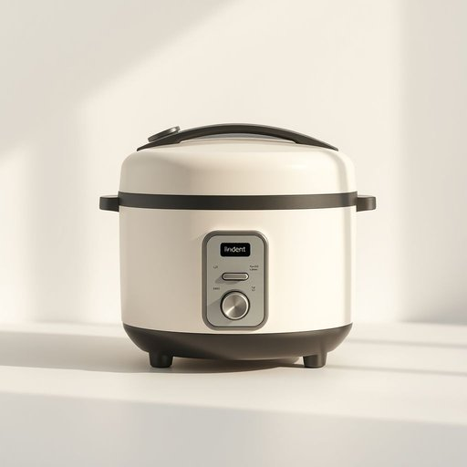

# rice-cooker

<h1 style="font-size: 2.5em; font-weight: 300; letter-spacing: 2px; margin: 0; color: #2c3e50;">
/rice-cooker*/
</h1>

---

---

## 例句

Although the rice-cooker is often overlooked in favor of more modern appliances, its efficiency as a cooking device, combined with its ability to deliver consistent results, makes it an essential tool in kitchens where precise temperature control and convenience are paramount.

*Although(/ˌɔlˈðoʊ/) the(/ðə/) rice-cooker(/rice-cooker*/) is(/ɪz/) often(/ˈɔfən/) overlooked(/ˈoʊvərˌlʊkt/) in(/ɪn/) favor(/ˈfeɪvər/) of(/əv/) more(/mɔr/) modern(/ˈmɑdərn/) appliances,(/əˈplaɪənsɪz,/) its(/ɪts/) efficiency(/ɪˈfɪʃənsi/) as(/ɛz/) a(/ə/) cooking(/ˈkʊkɪŋ/) device,(/dɪˈvaɪs,/) combined(/kəmˈbaɪnd/) with(/wɪθ/) its(/ɪts/) ability(/əˈbɪləˌti/) to(/tɪ/) deliver(/dɪˈlɪvər/) consistent(/kənˈsɪstənt/) results,(/rɪˈzəlts,/) makes(/meɪks/) it(/ɪt/) an(/ən/) essential(/ɛˈsɛnʃəl/) tool(/tul/) in(/ɪn/) kitchens(/ˈkɪʧənz/) where(/wɛr/) precise(/prɪˈsaɪs/) temperature(/ˈtɛmpərəʧər/) control(/kənˈtroʊl/) and(/ənd/) convenience(/kənˈvinjəns/) are(/ər/) paramount.(/ˈpɛrəˌmaʊnt./)*

**翻译：** 尽管电饭煲常被人们忽视，偏爱更现代的厨房电器，但它作为烹饪设备的高效性，加上能够稳定出品的能力，使其成为那些对精准温控和便利性有着极高要求的厨房中必不可少的工具。

---

## 解释

英语单词“rice-cooker”作为名词，指的是一种专门用来煮米饭的家用电器，广泛应用于家庭厨房中，特别是在以米饭为主食的亚洲家庭环境里最为常见。使用时，通常出现在谈论厨房用具、烹饪设备或家居生活品质提升的语境中，比如“How to use a rice-cooker”或“I bought a new rice-cooker”。语法上，“rice-cooker”是可数名词，复数形式为“rice-cookers”，可直接作为主语、宾语或表语使用。常见搭配包括“electric rice-cooker”（电饭煲）、“multifunction rice-cooker”（多功能电饭煲）等，表达时可以注意连接词“rice”和“cooker”的组合形式，以体现专指的含义。词源上，“rice-cooker”由“rice”（米饭）和“cooker”（烹饪器具）两个英语单词组成，直译即“米饭烹饪器”，起源于20世纪中期电饭煲普及之前后，技术发展带动了该词的产生和广泛使用。在中文语境中，“rice-cooker”准确翻译为“电饭煲”或“电饭锅”，属于中性词汇，通常无褒贬色彩，而是日常生活中必备的厨房电器，体现了现代家庭对便捷、高效烹饪的需求。其文化内涵则反映了以米饭为主食地区家庭饮食习惯和生活方式的现代化演变。

---

<small style="color: #999; font-size: 0.9em;">2025-07-17 06:22:40</small>

